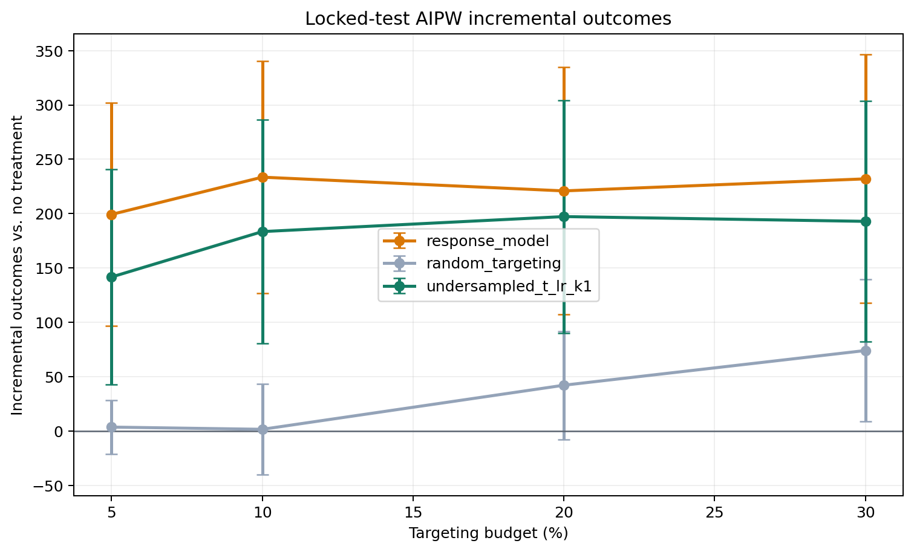

# Honest Uplift Model Selection: Criteo conversion

## Locked Protocol

- Data: `data/processed/criteo_audit_1m.parquet` (1,000,000 rows), outcome `conversion`.
- Base train/validation/test fractions: `0.60` / `0.20` / `0.20`.
- Selection folds: `3` over
  `800,000` selection observations.
- Primary targeting budget: `5.00%`.
- Confidence level: `95.0%`.
- Candidate model and hyperparameter selection uses 3-fold out-of-fold predictions on the combined development sample;
  locked-test outcomes are excluded.
- The champion is the candidate with the largest paired AIPW lower confidence
  bound against response targeting at the primary budget.
- Reference policies `response_model` and `random_targeting` are always
  evaluated but can never win selection.
- After selection, the champion and reference policies are refit on
  train + validation.
- Locked-test outcomes are opened once for the final comparison.

## Out-of-Sample Development Selection

| policy               | budget_pct | n_targeted | incremental_outcome_rate | standard_error_rate | ci_lower_rate | ci_upper_rate | incremental_outcome | ci_lower   | ci_upper   | benchmark_relative_auuc | difference_vs_response | difference_ci_lower | difference_ci_upper |
| -------------------- | ---------- | ---------- | ------------------------ | ------------------- | ------------- | ------------- | ------------------- | ---------- | ---------- | ----------------------- | ---------------------- | ------------------- | ------------------- |
| undersampled_t_lr_k1 | 5.000000   | 40000      | 0.000897                 | 0.000119            | 0.000664      | 0.001131      | 717.754769          | 531.020033 | 904.489506 | 0.001177                | 18.590258              | -68.482702          | 105.663219          |
| random_targeting     | 5.000000   | 40000      | 0.000074                 | 0.000029            | 0.000016      | 0.000132      | 59.297509           | 13.082656  | 105.512362 | 0.000620                | -639.867002            | -836.954913         | -442.779091         |
| response_model       | 5.000000   | 40000      | 0.000874                 | 0.000126            | 0.000626      | 0.001122      | 699.164511          | 500.825067 | 897.503954 | 0.001189                | nan                    | nan                 | nan                 |

Selected champion: **undersampled_t_lr_k1**.

## Locked-Test Policy Value

| policy               | budget_pct | n_targeted | incremental_outcome_rate | standard_error_rate | ci_lower_rate | ci_upper_rate | incremental_outcome | ci_lower   | ci_upper   |
| -------------------- | ---------- | ---------- | ------------------------ | ------------------- | ------------- | ------------- | ------------------- | ---------- | ---------- |
| response_model       | 5.000000   | 10000      | 0.000963                 | 0.000271            | 0.000432      | 0.001493      | 192.567868          | 86.486894  | 298.648842 |
| response_model       | 10.000000  | 20000      | 0.001139                 | 0.000282            | 0.000586      | 0.001692      | 227.768470          | 117.223019 | 338.313921 |
| response_model       | 20.000000  | 40000      | 0.001198                 | 0.000292            | 0.000626      | 0.001769      | 239.507563          | 125.144088 | 353.871038 |
| response_model       | 30.000000  | 60000      | 0.001194                 | 0.000294            | 0.000618      | 0.001771      | 238.869870          | 123.563649 | 354.176090 |
| random_targeting     | 5.000000   | 10000      | -0.000013                | 0.000066            | -0.000141     | 0.000116      | -2.573075           | -28.250375 | 23.104224  |
| random_targeting     | 10.000000  | 20000      | -0.000014                | 0.000100            | -0.000211     | 0.000183      | -2.807603           | -42.148911 | 36.533705  |
| random_targeting     | 20.000000  | 40000      | 0.000070                 | 0.000128            | -0.000181     | 0.000321      | 13.954955           | -36.194289 | 64.104200  |
| random_targeting     | 30.000000  | 60000      | -0.000024                | 0.000169            | -0.000355     | 0.000306      | -4.887022           | -70.954506 | 61.180463  |
| undersampled_t_lr_k1 | 5.000000   | 10000      | 0.000851                 | 0.000255            | 0.000351      | 0.001352      | 170.254713          | 70.107397  | 270.402030 |
| undersampled_t_lr_k1 | 10.000000  | 20000      | 0.001060                 | 0.000266            | 0.000538      | 0.001582      | 211.940063          | 107.524837 | 316.355288 |
| undersampled_t_lr_k1 | 20.000000  | 40000      | 0.001154                 | 0.000278            | 0.000609      | 0.001698      | 230.736521          | 121.843041 | 339.630002 |
| undersampled_t_lr_k1 | 30.000000  | 60000      | 0.001154                 | 0.000280            | 0.000605      | 0.001703      | 230.783055          | 120.913433 | 340.652678 |

## Paired Contrast Against Response Targeting

| policy               | reference_policy | budget_pct | n_targeted | difference_rate | standard_error_rate | difference  | ci_lower    | ci_upper    |
| -------------------- | ---------------- | ---------- | ---------- | --------------- | ------------------- | ----------- | ----------- | ----------- |
| random_targeting     | response_model   | 5.000000   | 10000      | -0.000976       | 0.000268            | -195.140943 | -300.060632 | -90.221254  |
| undersampled_t_lr_k1 | response_model   | 5.000000   | 10000      | -0.000112       | 0.000109            | -22.313154  | -64.873446  | 20.247138   |
| random_targeting     | response_model   | 10.000000  | 20000      | -0.001153       | 0.000268            | -230.576072 | -335.718788 | -125.433357 |
| undersampled_t_lr_k1 | response_model   | 10.000000  | 20000      | -0.000079       | 0.000107            | -15.828407  | -57.959254  | 26.302440   |
| random_targeting     | response_model   | 20.000000  | 40000      | -0.001128       | 0.000262            | -225.552607 | -328.415173 | -122.690042 |
| undersampled_t_lr_k1 | response_model   | 20.000000  | 40000      | -0.000044       | 0.000090            | -8.771041   | -44.199806  | 26.657724   |
| random_targeting     | response_model   | 30.000000  | 60000      | -0.001219       | 0.000246            | -243.756891 | -340.248024 | -147.265759 |
| undersampled_t_lr_k1 | response_model   | 30.000000  | 60000      | -0.000040       | 0.000090            | -8.086814   | -43.407088  | 27.233459   |

At the pre-specified `5.00%` budget, the locked test
was inconclusive relative to response targeting. The estimated difference is `-22.3132`
incremental conversion outcomes with a confidence interval of
`[-64.8734, 20.2471]`.

## Ranking Metrics

| policy               | benchmark_relative_auuc |
| -------------------- | ----------------------- |
| response_model       | 0.001205                |
| undersampled_t_lr_k1 | 0.001115                |
| random_targeting     | 0.000567                |

AUUC is secondary. The decision is based on the budget-specific AIPW policy
contrast because the campaign has a fixed operating budget.

## Runtime

| stage            | model                   | fit_seconds |
| ---------------- | ----------------------- | ----------- |
| selection_fold_1 | random_targeting        | 0.000062    |
| selection_fold_1 | response_model          | 10.287219   |
| selection_fold_1 | undersampled_t_lr_k1    | 1.915795    |
| selection_fold_1 | aipw_nuisance_t_learner | 9.564255    |
| selection_fold_2 | random_targeting        | 0.000034    |
| selection_fold_2 | response_model          | 5.831816    |
| selection_fold_2 | undersampled_t_lr_k1    | 1.919052    |
| selection_fold_2 | aipw_nuisance_t_learner | 9.763573    |
| selection_fold_3 | random_targeting        | 0.000032    |
| selection_fold_3 | response_model          | 6.090716    |
| selection_fold_3 | undersampled_t_lr_k1    | 1.805453    |
| selection_fold_3 | aipw_nuisance_t_learner | 9.614760    |
| locked_test      | response_model          | 7.406766    |
| locked_test      | random_targeting        | 0.000036    |
| locked_test      | undersampled_t_lr_k1    | 2.612611    |
| locked_test      | aipw_nuisance_t_learner | 11.399049   |

## Statistical Scope

The AIPW intervals account for evaluation-sample uncertainty conditional on the
locked fitted policies. Repeated honest splits are required to quantify training
and selection instability. No production-impact claim is made without a live
randomized experiment.

## Reproducible Outputs

- Selection values: `outputs/tables/audit_conversion_selection.csv`
- Locked-test values: `outputs/tables/audit_conversion_test.csv`
- Paired contrasts: `outputs/tables/audit_conversion_contrasts.csv`
