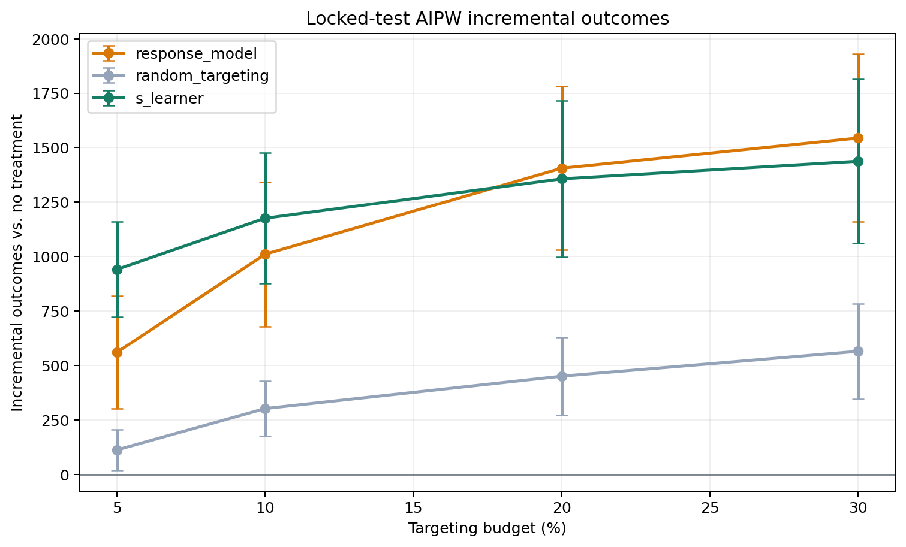

# Honest Uplift Model Selection: Criteo visit

## Locked Protocol

- Data: `data/processed/criteo_audit_1m.parquet` (1,000,000 rows), outcome `visit`.
- Base train/validation/test fractions: `0.60` / `0.20` / `0.20`.
- Selection folds: `3` over
  `800,000` selection observations.
- Primary targeting budget: `5.00%`.
- Confidence level: `95.0%`.
- Candidate model and hyperparameter selection uses 3-fold out-of-fold predictions on the combined development sample;
  locked-test outcomes are excluded.
- The champion is the candidate with the largest paired AIPW lower confidence
  bound against response targeting at the primary budget.
- Reference policies `response_model` and `random_targeting` are always
  evaluated but can never win selection.
- After selection, the champion and reference policies are refit on
  train + validation.
- Locked-test outcomes are opened once for the final comparison.

## Out-of-Sample Development Selection

| policy              | budget_pct | n_targeted | incremental_outcome_rate | standard_error_rate | ci_lower_rate | ci_upper_rate | incremental_outcome | ci_lower    | ci_upper    | benchmark_relative_auuc | difference_vs_response | difference_ci_lower | difference_ci_upper |
| ------------------- | ---------- | ---------- | ------------------------ | ------------------- | ------------- | ------------- | ------------------- | ----------- | ----------- | ----------------------- | ---------------------- | ------------------- | ------------------- |
| s_learner           | 5.000000   | 40000      | 0.004907                 | 0.000281            | 0.004356      | 0.005459      | 3925.912961         | 3484.681153 | 4367.144769 | 0.009805                | 927.967129             | 491.509958          | 1364.424301         |
| x_learner           | 5.000000   | 40000      | 0.004151                 | 0.000285            | 0.003593      | 0.004709      | 3320.809352         | 2874.172353 | 3767.446350 | 0.008867                | 322.863520             | -113.706339         | 759.433378          |
| transformed_outcome | 5.000000   | 40000      | 0.004112                 | 0.000265            | 0.003593      | 0.004631      | 3289.518281         | 2874.313371 | 3704.723192 | 0.009715                | 291.572450             | -131.730845         | 714.875744          |
| dr_learner          | 5.000000   | 40000      | 0.004082                 | 0.000281            | 0.003530      | 0.004634      | 3265.573726         | 2824.319473 | 3706.827979 | 0.008665                | 267.627894             | -168.730691         | 703.986479          |
| r_learner           | 5.000000   | 40000      | 0.003918                 | 0.000284            | 0.003362      | 0.004474      | 3134.720986         | 2689.882864 | 3579.559107 | 0.008819                | 136.775154             | -294.041238         | 567.591546          |
| t_learner           | 5.000000   | 40000      | 0.003796                 | 0.000285            | 0.003238      | 0.004354      | 3036.810749         | 2590.499745 | 3483.121752 | 0.008169                | 38.864917              | -408.716931         | 486.446765          |
| cvt                 | 5.000000   | 40000      | 0.003145                 | 0.000264            | 0.002628      | 0.003661      | 2515.766754         | 2102.576519 | 2928.956989 | 0.007833                | -482.179078            | -905.987611         | -58.370545          |
| random_targeting    | 5.000000   | 40000      | 0.000400                 | 0.000111            | 0.000183      | 0.000617      | 319.883211          | 146.468127  | 493.298295  | 0.005456                | -2678.062621           | -3193.306309        | -2162.818933        |
| response_model      | 5.000000   | 40000      | 0.003747                 | 0.000324            | 0.003111      | 0.004383      | 2997.945832         | 2489.169415 | 3506.722248 | 0.009882                | nan                    | nan                 | nan                 |

Selected champion: **s_learner**.

## Locked-Test Policy Value

| policy           | budget_pct | n_targeted | incremental_outcome_rate | standard_error_rate | ci_lower_rate | ci_upper_rate | incremental_outcome | ci_lower    | ci_upper    |
| ---------------- | ---------- | ---------- | ------------------------ | ------------------- | ------------- | ------------- | ------------------- | ----------- | ----------- |
| response_model   | 5.000000   | 10000      | 0.002804                 | 0.000660            | 0.001510      | 0.004097      | 560.700709          | 302.031839  | 819.369579  |
| response_model   | 10.000000  | 20000      | 0.005054                 | 0.000844            | 0.003401      | 0.006707      | 1010.806523         | 680.119399  | 1341.493647 |
| response_model   | 20.000000  | 40000      | 0.007030                 | 0.000955            | 0.005158      | 0.008903      | 1406.057791         | 1031.556202 | 1780.559380 |
| response_model   | 30.000000  | 60000      | 0.007722                 | 0.000983            | 0.005796      | 0.009648      | 1544.317365         | 1159.112070 | 1929.522660 |
| random_targeting | 5.000000   | 10000      | 0.000563                 | 0.000237            | 0.000098      | 0.001027      | 112.506298          | 19.537559   | 205.475037  |
| random_targeting | 10.000000  | 20000      | 0.001512                 | 0.000323            | 0.000879      | 0.002145      | 302.466248          | 175.842259  | 429.090236  |
| random_targeting | 20.000000  | 40000      | 0.002255                 | 0.000454            | 0.001365      | 0.003144      | 450.912491          | 273.099967  | 628.725015  |
| random_targeting | 30.000000  | 60000      | 0.002825                 | 0.000558            | 0.001731      | 0.003919      | 565.090576          | 346.285631  | 783.895520  |
| s_learner        | 5.000000   | 10000      | 0.004706                 | 0.000557            | 0.003615      | 0.005798      | 941.242565          | 722.964570  | 1159.520561 |
| s_learner        | 10.000000  | 20000      | 0.005881                 | 0.000765            | 0.004381      | 0.007380      | 1176.124470         | 876.256072  | 1475.992868 |
| s_learner        | 20.000000  | 40000      | 0.006786                 | 0.000916            | 0.004990      | 0.008581      | 1357.110484         | 997.984225  | 1716.236743 |
| s_learner        | 30.000000  | 60000      | 0.007190                 | 0.000960            | 0.005307      | 0.009072      | 1437.908700         | 1061.429689 | 1814.387710 |

## Paired Contrast Against Response Targeting

| policy           | reference_policy | budget_pct | n_targeted | difference_rate | standard_error_rate | difference  | ci_lower     | ci_upper    |
| ---------------- | ---------------- | ---------- | ---------- | --------------- | ------------------- | ----------- | ------------ | ----------- |
| random_targeting | response_model   | 5.000000   | 10000      | -0.002241       | 0.000669            | -448.194411 | -710.498609  | -185.890213 |
| s_learner        | response_model   | 5.000000   | 10000      | 0.001903        | 0.000553            | 380.541856  | 163.633271   | 597.450441  |
| random_targeting | response_model   | 10.000000  | 20000      | -0.003542       | 0.000821            | -708.340276 | -1030.260083 | -386.420468 |
| s_learner        | response_model   | 10.000000  | 20000      | 0.000827        | 0.000470            | 165.317947  | -18.905353   | 349.541247  |
| random_targeting | response_model   | 20.000000  | 40000      | -0.004776       | 0.000868            | -955.145300 | -1295.314685 | -614.975916 |
| s_learner        | response_model   | 20.000000  | 40000      | -0.000245       | 0.000326            | -48.947307  | -176.652437  | 78.757822   |
| random_targeting | response_model   | 30.000000  | 60000      | -0.004896       | 0.000825            | -979.226789 | -1302.640848 | -655.812730 |
| s_learner        | response_model   | 30.000000  | 60000      | -0.000532       | 0.000275            | -106.408665 | -214.337453  | 1.520123    |

At the pre-specified `5.00%` budget, the locked test
showed a negative advantage relative to response targeting. The estimated difference is `-448.1944`
incremental visit outcomes with a confidence interval of
`[-710.4986, -185.8902]`.

## Ranking Metrics

| policy           | benchmark_relative_auuc |
| ---------------- | ----------------------- |
| response_model   | 0.009761                |
| s_learner        | 0.009464                |
| random_targeting | 0.005746                |

AUUC is secondary. The decision is based on the budget-specific AIPW policy
contrast because the campaign has a fixed operating budget.

## Runtime

| stage            | model                   | fit_seconds |
| ---------------- | ----------------------- | ----------- |
| selection_fold_1 | random_targeting        | 0.000037    |
| selection_fold_1 | response_model          | 9.909189    |
| selection_fold_1 | s_learner               | 5.336470    |
| selection_fold_1 | t_learner               | 8.305229    |
| selection_fold_1 | x_learner               | 15.080767   |
| selection_fold_1 | cvt                     | 5.202776    |
| selection_fold_1 | transformed_outcome     | 0.281094    |
| selection_fold_1 | r_learner               | 46.032446   |
| selection_fold_1 | dr_learner              | 49.505812   |
| selection_fold_1 | aipw_nuisance_t_learner | 6.874028    |
| selection_fold_2 | random_targeting        | 0.000041    |
| selection_fold_2 | response_model          | 5.522857    |
| selection_fold_2 | s_learner               | 5.577073    |
| selection_fold_2 | t_learner               | 8.407147    |
| selection_fold_2 | x_learner               | 15.258142   |
| selection_fold_2 | cvt                     | 4.959836    |
| selection_fold_2 | transformed_outcome     | 0.289658    |
| selection_fold_2 | r_learner               | 46.373234   |
| selection_fold_2 | dr_learner              | 50.870206   |
| selection_fold_2 | aipw_nuisance_t_learner | 6.733593    |
| selection_fold_3 | random_targeting        | 0.000034    |
| selection_fold_3 | response_model          | 5.110152    |
| selection_fold_3 | s_learner               | 6.180890    |
| selection_fold_3 | t_learner               | 8.309853    |
| selection_fold_3 | x_learner               | 16.034719   |
| selection_fold_3 | cvt                     | 4.829105    |
| selection_fold_3 | transformed_outcome     | 0.290569    |
| selection_fold_3 | r_learner               | 46.735954   |
| selection_fold_3 | dr_learner              | 48.119241   |
| selection_fold_3 | aipw_nuisance_t_learner | 6.092580    |
| locked_test      | response_model          | 6.650300    |
| locked_test      | random_targeting        | 0.000039    |
| locked_test      | s_learner               | 7.196775    |
| locked_test      | aipw_nuisance_t_learner | 8.797115    |

## Statistical Scope

The AIPW intervals account for evaluation-sample uncertainty conditional on the
locked fitted policies. Repeated honest splits are required to quantify training
and selection instability. No production-impact claim is made without a live
randomized experiment.

## Reproducible Outputs

- Selection values: `outputs/tables/audit_visit_selection.csv`
- Locked-test values: `outputs/tables/audit_visit_test.csv`
- Paired contrasts: `outputs/tables/audit_visit_contrasts.csv`
