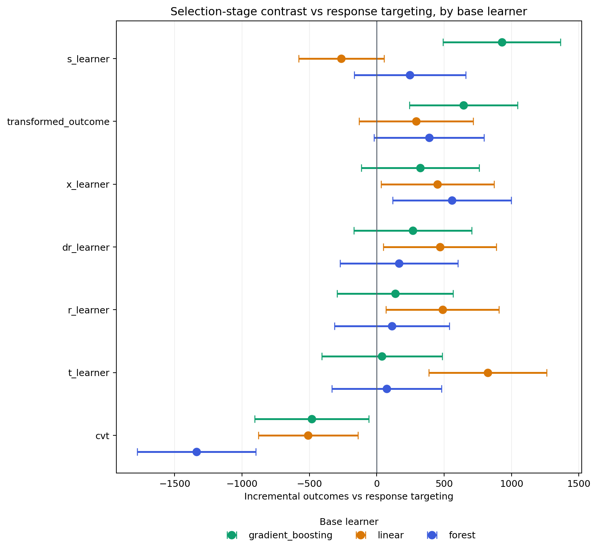

# Does the Champion Depend on the Base Learner?

## Why This Exists

Every uplift learner in this project is a recipe that turns ordinary
supervised estimators into an effect estimate, and every published run
gave all of them the same boosted trees. A ranking produced that way is
a statement about the recipes *at one estimator*, which is weaker than
the statement the README makes on the strength of it.

The repeated-splits experiment in `visit_stability.md` varies the data
the recipes see. It holds the estimator fixed, so it cannot answer this.
This report varies the estimator and holds everything else fixed.

It is a development-stage study. It re-reads a decision that has already
been made rather than making a new one, so it changes no locked policy
and opens no confirmatory sample.

## Protocol

- Sample: `data/processed/criteo_audit_1m.parquet`, `1,000,000` rows, outcome `visit`.
- Selection: `3`-fold out-of-fold policy selection,
  seed `777`, decided at the `5%` budget.
- Candidates: `7` uplift learners, `3`
  base learner families (`gradient_boosting`, `linear`, `forest`).
- Sample, folds, seed, and budget all match the run that chose the locked
  champion. A cheaper selection stage would widen every interval and show
  up here as a ranking that moves with the base learner when it actually
  moved with the sample size.
- Reference policies stay on boosted trees in every column. Response
  targeting stands for what the business already does, so it has to be one
  fixed bar rather than a bar that moves with the family under test.
- The AIPW nuisance models that score every candidate also stay on boosted
  trees. The estimator under test is the one inside the candidates, not the
  one doing the measuring, and moving both at once would confound them.
- The `gradient_boosting` column is not the locked configuration. The locked
  one was never uniform: `transformed_outcome` uses ridge on purpose, because
  at a propensity of 0.85 its regression target takes three values and a
  flexible learner fits the spikes. Making the column uniform overrides that
  choice, which is a claim worth testing rather than one to preserve. Every
  other candidate in that column is the locked one, to the last bit.

## Selection Bound by Base Learner

Lower bound of the 95% interval on incremental
outcomes against response targeting at the 5% budget, which
is the number the selection rule reads. Rank within the family is in
brackets. Rows are ordered by the boosted-tree bound, so a family that
reorders the candidates shows up as brackets out of sequence.

| policy              | gradient_boosting | linear     | forest      |
| ------------------- | ----------------- | ---------- | ----------- |
| s_learner           | 491.5 (1)         | -579.0 (6) | -167.0 (3)  |
| transformed_outcome | 241.6 (2)         | -131.7 (5) | -20.7 (2)   |
| x_learner           | -113.7 (3)        | 31.0 (4)   | 117.3 (1)   |
| dr_learner          | -168.7 (4)        | 48.5 (3)   | -271.6 (4)  |
| r_learner           | -294.0 (5)        | 67.6 (2)   | -313.1 (5)  |
| t_learner           | -408.7 (6)        | 386.9 (1)  | -332.6 (6)  |
| cvt                 | -906.0 (7)        | -878.1 (7) | -1777.2 (7) |

## Who Wins in Each Family

| base_family       | champion  | runner_up           | selection_margin | champion_selection_halfwidth | margin_over_halfwidth | n_candidates_with_positive_bound |
| ----------------- | --------- | ------------------- | ---------------- | ---------------------------- | --------------------- | -------------------------------- |
| gradient_boosting | s_learner | transformed_outcome | 249.939306       | 436.457171                   | 0.572655              | 2                                |
| linear            | t_learner | r_learner           | 319.297036       | 437.666123                   | 0.729545              | 4                                |
| forest            | x_learner | transformed_outcome | 138.041144       | 440.868505                   | 0.313112              | 1                                |

`margin_over_halfwidth` is the gap between first and second place divided
by the half-width of the winner's own interval. Below 1 the sample cannot
resolve the gap it is ranking by, so the ordering is real but the winner is
not separated from the runner-up.

## What This Shows

**The winner changes with the base learner.** `gradient_boosting` picks `s_learner`, `linear` picks `t_learner`, `forest` picks `x_learner`. The locked champion was selected at one estimator, so its lead is a property of that pairing rather than of the learner alone.

Holding the same rank in every family: `cvt`.
Moving three places or more between families: `r_learner` (2 to 5), `s_learner` (1 to 6), `t_learner` (1 to 6), `transformed_outcome` (2 to 5), `x_learner` (1 to 4). A candidate that swings this far is being judged on its estimator as much as on its recipe.

In every family the winning margin is smaller than the half-width of the winner's own interval (largest ratio `0.73`). So none of these columns separates its first place from its second, and a reordering between families is movement inside the noise rather than evidence that one estimator suits one recipe better. The defensible reading is about the policy class, not about a single best learner.

## Reproduction Check

Before any column was compared, the locked configuration was run
again from the current code and checked row for row against
`outputs/tables/audit_visit_selection.csv`, which was written before base learner
families existed. Across `36` matched rows the
largest absolute difference in any reported quantity is
`4.547473509e-13`.

No policy moved. What remains is float round-off on counts in the thousands, which is what a sum reassembled in a different order costs, so threading the estimator choice through the learners left the published path as it was and the columns above can be read against it.

## Reproducible Outputs

- Every candidate in every family: `outputs/tables/base_learner_comparison.csv`
- One row per family: `outputs/tables/base_learner_selection_summary.csv`
- Figure: `outputs/figures/base_learner_comparison.png`
