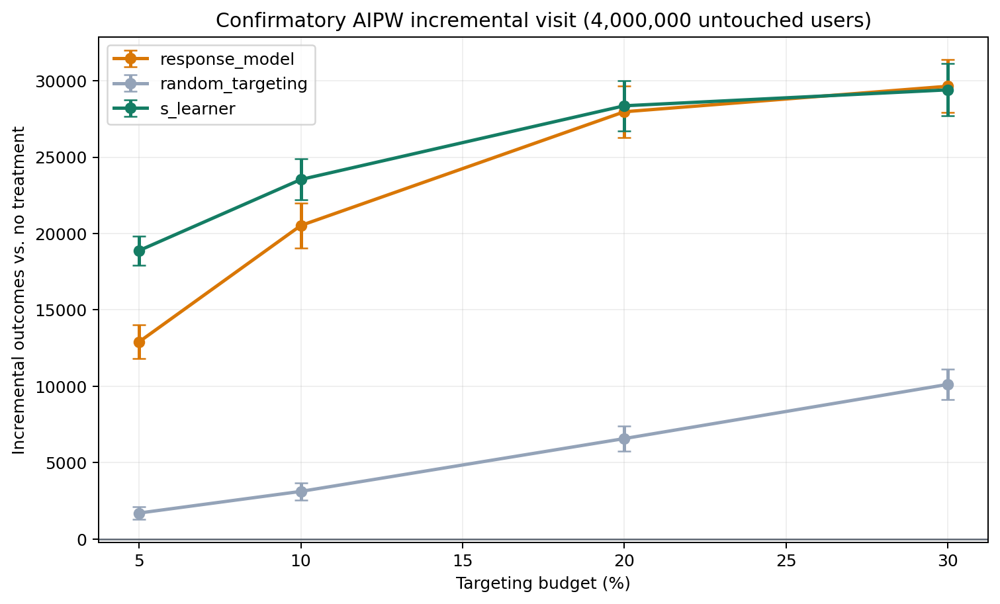

# Confirmatory Locked Test: Criteo visit

## Why This Stage Exists

The earlier locked test estimated a positive but inconclusive advantage for
`s_learner` at the `5.00%` budget. That
interval was wide because the test partition held only a fifth of a
one-million-row audit, not because the effect was known to be zero. The source
experiment has 13,979,592 randomized rows, so the cheapest way to sharpen the
answer is to spend unused rows on evaluation rather than to re-argue the same
numbers.

Nothing is selected here. The champion, the operating budget, the confidence
level, and the estimator were all locked before this sample was drawn.

## Protocol

- Locked champion: `s_learner` (selected earlier, on development data only).
- Refit sample: `data/processed/criteo_audit_1m.parquet` (1,000,000 rows).
- Confirmatory sample: `data/processed/criteo_confirm_4m.parquet` (4,000,000 rows), opened once.
- Verified overlap between the two samples: **0 rows**, by full-row hash.
- Reference policies: `response_model` (the incumbent) and `random_targeting`
  (the floor that shows how much of any gain is ranking skill).
- Treatment propensity used by AIPW: `0.845886`.
- Primary budget `5.00%`, confidence level
  `95.0%`.

## Policy Value

| policy           | budget_pct | n_targeted | incremental_outcome_rate | standard_error_rate | ci_lower_rate | ci_upper_rate | incremental_outcome | ci_lower     | ci_upper     |
| ---------------- | ---------- | ---------- | ------------------------ | ------------------- | ------------- | ------------- | ------------------- | ------------ | ------------ |
| response_model   | 5.000000   | 200000     | 0.003226                 | 0.000142            | 0.002949      | 0.003504      | 12905.158277        | 11794.185853 | 14016.130701 |
| response_model   | 10.000000  | 400000     | 0.005131                 | 0.000186            | 0.004767      | 0.005496      | 20525.386111        | 19067.433491 | 21983.338730 |
| response_model   | 20.000000  | 800000     | 0.006993                 | 0.000213            | 0.006575      | 0.007412      | 27973.913758        | 26300.786150 | 29647.041366 |
| response_model   | 30.000000  | 1200000    | 0.007411                 | 0.000221            | 0.006978      | 0.007845      | 29644.509094        | 27910.039374 | 31378.978814 |
| random_targeting | 5.000000   | 200000     | 0.000424                 | 0.000051            | 0.000324      | 0.000525      | 1696.854961         | 1295.424946  | 2098.284976  |
| random_targeting | 10.000000  | 400000     | 0.000779                 | 0.000073            | 0.000636      | 0.000921      | 3114.144786         | 2542.312859  | 3685.976712  |
| random_targeting | 20.000000  | 800000     | 0.001643                 | 0.000103            | 0.001442      | 0.001845      | 6573.824175         | 5768.454834  | 7379.193515  |
| random_targeting | 30.000000  | 1200000    | 0.002531                 | 0.000125            | 0.002285      | 0.002776      | 10122.538744        | 9140.920911  | 11104.156578 |
| s_learner        | 5.000000   | 200000     | 0.004721                 | 0.000122            | 0.004482      | 0.004960      | 18884.200638        | 17929.730830 | 19838.670446 |
| s_learner        | 10.000000  | 400000     | 0.005884                 | 0.000171            | 0.005550      | 0.006219      | 23537.047083        | 22198.058594 | 24876.035572 |
| s_learner        | 20.000000  | 800000     | 0.007091                 | 0.000208            | 0.006684      | 0.007499      | 28364.881081        | 26734.769406 | 29994.992756 |
| s_learner        | 30.000000  | 1200000    | 0.007352                 | 0.000218            | 0.006925      | 0.007780      | 29409.193564        | 27699.953204 | 31118.433925 |

## Paired Contrast Against Response Targeting

| policy           | reference_policy | budget_pct | n_targeted | difference_rate | standard_error_rate | difference    | ci_lower      | ci_upper      |
| ---------------- | ---------------- | ---------- | ---------- | --------------- | ------------------- | ------------- | ------------- | ------------- |
| random_targeting | response_model   | 5.000000   | 200000     | -0.002802       | 0.000144            | -11208.303316 | -12335.321059 | -10081.285573 |
| s_learner        | response_model   | 5.000000   | 200000     | 0.001495        | 0.000124            | 5979.042361   | 5005.713972   | 6952.370750   |
| random_targeting | response_model   | 10.000000  | 400000     | -0.004353       | 0.000182            | -17411.241325 | -18834.277713 | -15988.204937 |
| s_learner        | response_model   | 10.000000  | 400000     | 0.000753        | 0.000104            | 3011.660972   | 2192.572330   | 3830.749614   |
| random_targeting | response_model   | 20.000000  | 800000     | -0.005350       | 0.000194            | -21400.089583 | -22921.234742 | -19878.944424 |
| s_learner        | response_model   | 20.000000  | 800000     | 0.000098        | 0.000062            | 390.967323    | -96.379592    | 878.314239    |
| random_targeting | response_model   | 30.000000  | 1200000    | -0.004880       | 0.000188            | -19521.970350 | -20994.811423 | -18049.129276 |
| s_learner        | response_model   | 30.000000  | 1200000    | -0.000059       | 0.000052            | -235.315530   | -644.454872   | 173.823813    |

At the pre-specified `5.00%` budget the confirmatory
sample confirmed a positive advantage over response targeting at the pre-specified budget. The estimated difference is
`5979.0424` incremental visit outcomes with a
`95.0%` interval of
`[5005.7140, 6952.3707]`.

## Precision Gained

| stage               | n_evaluated | difference_per_100k | standard_error_per_100k | z_statistic | ci_lower_per_100k | ci_upper_per_100k | excludes_zero | standard_error_reduction |
| ------------------- | ----------- | ------------------- | ----------------------- | ----------- | ----------------- | ----------------- | ------------- | ------------------------ |
| Earlier locked test | 200000      | 133.261903          | 56.814515               | 2.345561    | 21.907500         | 244.616305        | True          | 1.000000                 |
| Confirmatory test   | 4000000     | 149.476059          | 12.415131               | 12.039829   | 125.142849        | 173.809269        | True          | 4.576232                 |

Both stages estimate the same locked policy, so the difference between them is
evaluation precision, not a different effect. Figures are normalized per 100,000
evaluated users because totals scale with the sample and are not comparable; the
z-statistic is scale-free and comparable as printed. Agreement between the two
per-100,000 point estimates is the check that the larger sample bought precision
rather than a new answer.

## Ranking Metrics

| policy           | benchmark_relative_auuc |
| ---------------- | ----------------------- |
| response_model   | 0.011798                |
| s_learner        | 0.011639                |
| random_targeting | 0.006630                |

Relative AUUC scores the whole ranking. The decision is made on the
budget-specific paired contrast because the campaign can only treat a fixed
share of users.

## Runtime

| stage       | model                   | fit_seconds |
| ----------- | ----------------------- | ----------- |
| locked_test | response_model          | 14.330793   |
| locked_test | random_targeting        | 0.000049    |
| locked_test | s_learner               | 10.221461   |
| locked_test | aipw_nuisance_t_learner | 12.098502   |

## Interpretation Boundaries

- The confirmatory sample is disjoint from every earlier sample but is drawn
  from the same source experiment and the same time period.
- The interval conditions on the fitted policies; it does not carry the
  uncertainty of having chosen `s_learner` in the first place. Selection
  stability is measured separately by the repeated-split experiment.
- AIPW treats the treatment propensity as known, as is standard for a
  randomized design; the propensity is estimated from the refit sample.
- Offline evidence bounds what a live campaign might do. It does not replace a
  randomized online test, and it carries no claim about revenue.

## Reproducible Outputs

- Policy values: `outputs/tables/confirmatory_visit_test.csv`
- Paired contrasts: `outputs/tables/confirmatory_visit_contrasts.csv`
