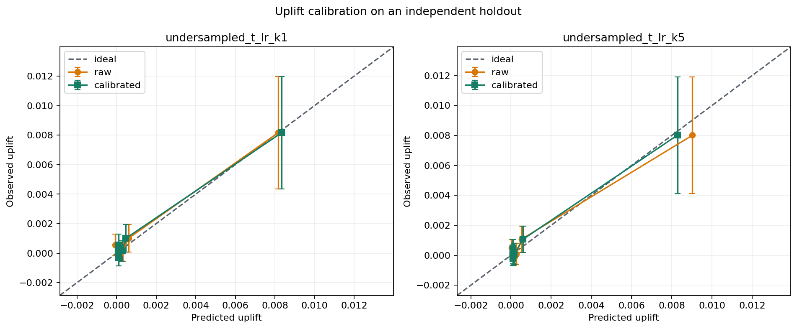

# Uplift-Score Calibration on an Independent Holdout

## Setup

- Data: `data/processed/criteo_sample_2m.parquet` (2,000,000 rows), outcome `conversion`.
- Train/calibration/test rows: 1,200,000 / 400,000 / 400,000.
- Treatment propensity estimated from training data: `0.849612`.
- Model: `undersampled_t_lr_k1,undersampled_t_lr_k5`; random seed `42`.
- The isotonic calibrator is fitted only on the calibration set using transformed outcomes.
- The calibrator is fitted on `100` weighted quantile groups
  to reduce pseudo-outcome noise.
- Calibration metrics and threshold policies are evaluated only on the untouched test holdout.

## Calibration Results Summary

| model                | score_version | weighted_bias | weighted_mae | weighted_rmse | euce     | muce     | calibration_intercept | calibration_slope | benchmark_relative_auuc | score_mean | score_min | score_max |
| -------------------- | ------------- | ------------- | ------------ | ------------- | -------- | -------- | --------------------- | ----------------- | ----------------------- | ---------- | --------- | --------- |
| undersampled_t_lr_k1 | raw           | -0.000025     | 0.000229     | 0.000290      | 0.000229 | 0.000616 | -0.000029             | 1.004239          | 0.001069                | 0.000989   | -0.056067 | 0.236139  |
| undersampled_t_lr_k1 | calibrated    | -0.000025     | 0.000219     | 0.000274      | 0.000219 | 0.000537 | -0.000008             | 0.982596          | 0.001058                | 0.000989   | 0.000112  | 0.050384  |
| undersampled_t_lr_k5 | raw           | -0.000118     | 0.000318     | 0.000426      | 0.000318 | 0.001015 | 0.000000              | 0.889454          | 0.001059                | 0.001068   | -0.057866 | 0.242857  |
| undersampled_t_lr_k5 | calibrated    | -0.000024     | 0.000196     | 0.000247      | 0.000196 | 0.000469 | 0.000004              | 0.970915          | 0.001085                | 0.000975   | 0.000101  | 0.055872  |

Ideal calibration has an intercept near `0`, a slope near `1`, and errors near
`0`. Based on weighted MAE on the holdout, calibration improves: `undersampled_t_lr_k1`, `undersampled_t_lr_k5`.
Isotonic mapping is monotonic and therefore preserves ordering in principle;
AUUC may change slightly because multiple scores can be mapped to the same value.

## Post-Calibration Groups

| model                | bin | n     | predicted_uplift | observed_uplift | ci_lower  | ci_upper |
| -------------------- | --- | ----- | ---------------- | --------------- | --------- | -------- |
| undersampled_t_lr_k1 | 1   | 40000 | 0.008341         | 0.008167        | 0.004356  | 0.011978 |
| undersampled_t_lr_k1 | 2   | 40000 | 0.000472         | 0.001009        | 0.000067  | 0.001951 |
| undersampled_t_lr_k1 | 3   | 40000 | 0.000291         | 0.000144        | -0.000563 | 0.000851 |
| undersampled_t_lr_k1 | 4   | 40000 | 0.000112         | 0.000020        | -0.000482 | 0.000523 |
| undersampled_t_lr_k1 | 5   | 40000 | 0.000112         | -0.000046       | -0.000389 | 0.000296 |
| undersampled_t_lr_k1 | 6   | 40000 | 0.000112         | 0.000044        | -0.000310 | 0.000398 |
| undersampled_t_lr_k1 | 7   | 40000 | 0.000112         | 0.000089        | -0.000012 | 0.000189 |
| undersampled_t_lr_k1 | 8   | 40000 | 0.000112         | -0.000050       | -0.000397 | 0.000298 |
| undersampled_t_lr_k1 | 9   | 40000 | 0.000112         | -0.000285       | -0.000862 | 0.000292 |
| undersampled_t_lr_k1 | 10  | 40000 | 0.000112         | 0.000549        | -0.000196 | 0.001293 |
| undersampled_t_lr_k5 | 1   | 40000 | 0.008277         | 0.008012        | 0.004119  | 0.011905 |
| undersampled_t_lr_k5 | 2   | 40000 | 0.000597         | 0.001066        | 0.000194  | 0.001937 |
| undersampled_t_lr_k5 | 3   | 40000 | 0.000165         | 0.000084        | -0.000619 | 0.000787 |
| undersampled_t_lr_k5 | 4   | 40000 | 0.000101         | -0.000096       | -0.000584 | 0.000392 |
| undersampled_t_lr_k5 | 5   | 40000 | 0.000101         | -0.000046       | -0.000387 | 0.000295 |
| undersampled_t_lr_k5 | 6   | 40000 | 0.000101         | 0.000059        | -0.000023 | 0.000141 |
| undersampled_t_lr_k5 | 7   | 40000 | 0.000101         | -0.000210       | -0.000679 | 0.000259 |
| undersampled_t_lr_k5 | 8   | 40000 | 0.000101         | 0.000071        | -0.000291 | 0.000433 |
| undersampled_t_lr_k5 | 9   | 40000 | 0.000101         | 0.000074        | -0.000283 | 0.000432 |
| undersampled_t_lr_k5 | 10  | 40000 | 0.000101         | 0.000492        | -0.000060 | 0.001044 |

Bin 1 contains the group with the highest raw scores. The confidence interval is
a normal approximation for the difference between treatment and control rates
within each bin. All bins are stored at `outputs/tables/conversion_uplift_calibration_bins.csv`.

## Threshold Policy Under Assumed Unit Economics

> **These currency figures are a worked example, not a finding.** The outcome
> value and the cost per contact below are command-line placeholders, not
> measured business inputs. Nothing here supports a revenue or ROI claim; the
> section exists only to show how a calibrated score would be turned into a
> break-even decision rule once real unit economics are available.

- Assumed value of one incremental conversion: `100.00`.
- Assumed cost per targeting action: `5.00`.
- Implied break-even uplift threshold: `0.050000`.

| model                | score_version | score_threshold | target_rate_pct | n_targeted | incremental_outcome | net_value   | profitable |
| -------------------- | ------------- | --------------- | --------------- | ---------- | ------------------- | ----------- | ---------- |
| undersampled_t_lr_k1 | raw           | 0.050000        | 0.302000        | 1208       | 81.122961           | 2072.296116 | True       |
| undersampled_t_lr_k1 | calibrated    | 0.050000        | 0.326250        | 1305       | 78.959924           | 1370.992415 | True       |
| undersampled_t_lr_k5 | raw           | 0.050000        | 0.390250        | 1561       | 113.090401          | 3504.040061 | True       |
| undersampled_t_lr_k5 | calibrated    | 0.050000        | 0.390750        | 1563       | 112.723765          | 3457.376545 | True       |

Only `calibrated` rows can carry an absolute interpretation, because a raw score
is not on the probability scale. While calibration stability is unproven, the
fixed 5% budget remains the safer operating rule for the online experiment.

## Runtime

| model                | model_fit_seconds | calibrator_fit_seconds |
| -------------------- | ----------------- | ---------------------- |
| undersampled_t_lr_k1 | 5.793217          | 0.328657               |
| undersampled_t_lr_k5 | 1.262540          | 0.346562               |

## Recommendations

- Use the calibration plot to validate score magnitude, not as a replacement
  for AUUC as a ranking metric.
- Do not select a threshold on the test holdout after reviewing its results.
- Lock the model, calibrator, and threshold before the randomized online experiment.
