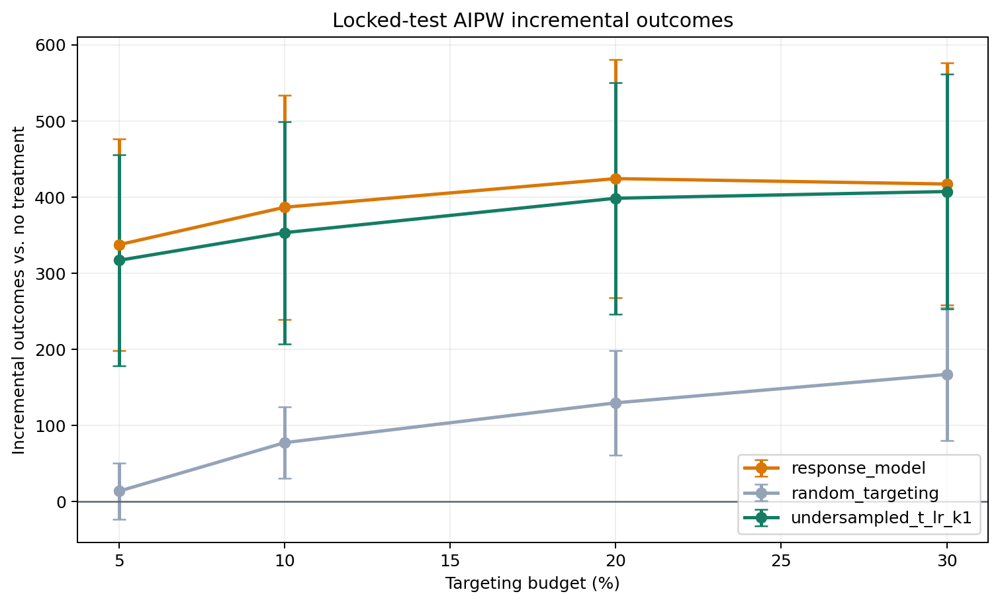

# Honest Uplift Model Selection: Criteo conversion

## Locked Protocol

- Data: `data/processed/criteo_sample_2m.parquet` (2,000,000 rows), outcome `conversion`.
- Base train/validation/test fractions: `0.60` / `0.20` / `0.20`.
- Selection folds: `3` over
  `1,600,000` selection observations.
- Primary targeting budget: `5.00%`.
- Confidence level: `95.0%`.
- Candidate model and hyperparameter selection uses 3-fold out-of-fold predictions on the combined development sample;
  locked-test outcomes are excluded.
- The champion is the candidate with the largest paired AIPW lower confidence
  bound against response targeting at the primary budget.
- Reference policies `response_model` and `random_targeting` are always
  evaluated but can never win selection.
- After selection, the champion and reference policies are refit on
  train + validation.
- Locked-test outcomes are opened once for the final comparison.

## Out-of-Sample Development Selection

| policy                   | budget_pct | n_targeted | incremental_outcome_rate | standard_error_rate | ci_lower_rate | ci_upper_rate | incremental_outcome | ci_lower   | ci_upper    | benchmark_relative_auuc | difference_vs_response | difference_ci_lower | difference_ci_upper |
| ------------------------ | ---------- | ---------- | ------------------------ | ------------------- | ------------- | ------------- | ------------------- | ---------- | ----------- | ----------------------- | ---------------------- | ------------------- | ------------------- |
| undersampled_t_lr_k1     | 5.000000   | 80000      | 0.000783                 | 0.000087            | 0.000611      | 0.000954      | 1252.056826         | 978.034471 | 1526.079181 | 0.001021                | 25.245140              | -78.345222          | 128.835502          |
| undersampled_t_lr_k5     | 5.000000   | 80000      | 0.000769                 | 0.000089            | 0.000594      | 0.000944      | 1230.392489         | 950.682359 | 1510.102619 | 0.001028                | 3.580803               | -83.051303          | 90.212909           |
| undersampled_t_lr_k10    | 5.000000   | 80000      | 0.000778                 | 0.000088            | 0.000607      | 0.000950      | 1245.447316         | 970.733945 | 1520.160686 | 0.000992                | 18.635630              | -84.307250          | 121.578509          |
| undersampled_t_lr_k50    | 5.000000   | 80000      | 0.000680                 | 0.000081            | 0.000520      | 0.000839      | 1087.258540         | 831.865298 | 1342.651782 | 0.000903                | -139.553146            | -291.766083         | 12.659791           |
| undersampled_t_lr_k25    | 5.000000   | 80000      | 0.000655                 | 0.000075            | 0.000508      | 0.000803      | 1048.577346         | 812.128781 | 1285.025911 | 0.000890                | -178.234340            | -354.107046         | -2.361633           |
| undersampled_t_lr_k100   | 5.000000   | 80000      | 0.000564                 | 0.000080            | 0.000407      | 0.000720      | 901.922197          | 651.259154 | 1152.585241 | 0.000789                | -324.889488            | -487.206226         | -162.572751         |
| undersampled_cvt_lr_k50  | 5.000000   | 80000      | 0.000535                 | 0.000067            | 0.000404      | 0.000666      | 856.233019          | 646.980077 | 1065.485961 | 0.000983                | -370.578667            | -580.548299         | -160.609035         |
| undersampled_cvt_lr_k100 | 5.000000   | 80000      | 0.000508                 | 0.000061            | 0.000389      | 0.000627      | 812.770115          | 622.725797 | 1002.814432 | 0.000952                | -414.041571            | -639.153624         | -188.929518         |
| undersampled_cvt_lr_k25  | 5.000000   | 80000      | 0.000466                 | 0.000078            | 0.000313      | 0.000619      | 745.221705          | 500.476486 | 989.966924  | 0.000854                | -481.589981            | -648.834509         | -314.345452         |
| undersampled_t_lr_k200   | 5.000000   | 80000      | 0.000424                 | 0.000068            | 0.000291      | 0.000558      | 678.502277          | 464.950788 | 892.053766  | 0.000594                | -548.309409            | -760.700174         | -335.918643         |
| undersampled_cvt_lr_k5   | 5.000000   | 80000      | 0.000406                 | 0.000072            | 0.000266      | 0.000546      | 649.476133          | 425.204462 | 873.747804  | 0.000557                | -577.335553            | -773.545177         | -381.125928         |
| undersampled_cvt_lr_k10  | 5.000000   | 80000      | 0.000376                 | 0.000074            | 0.000230      | 0.000522      | 601.487086          | 368.466329 | 834.507843  | 0.000632                | -625.324600            | -811.960459         | -438.688741         |
| undersampled_cvt_lr_k200 | 5.000000   | 80000      | 0.000299                 | 0.000045            | 0.000211      | 0.000387      | 478.315881          | 337.499078 | 619.132684  | 0.000770                | -748.495805            | -1006.801632        | -490.189978         |
| undersampled_cvt_lr_k1   | 5.000000   | 80000      | 0.000235                 | 0.000058            | 0.000121      | 0.000349      | 376.111115          | 194.161389 | 558.060842  | 0.000408                | -850.700570            | -1073.141164        | -628.259977         |
| random_targeting         | 5.000000   | 80000      | 0.000037                 | 0.000025            | -0.000011     | 0.000086      | 59.549865           | -18.078639 | 137.178369  | 0.000575                | -1167.261821           | -1447.036435        | -887.487206         |
| response_model           | 5.000000   | 80000      | 0.000767                 | 0.000091            | 0.000588      | 0.000945      | 1226.811686         | 941.281776 | 1512.341596 | 0.001076                | nan                    | nan                 | nan                 |

Selected champion: **undersampled_t_lr_k1**.

## Locked-Test Policy Value

| policy               | budget_pct | n_targeted | incremental_outcome_rate | standard_error_rate | ci_lower_rate | ci_upper_rate | incremental_outcome | ci_lower   | ci_upper   |
| -------------------- | ---------- | ---------- | ------------------------ | ------------------- | ------------- | ------------- | ------------------- | ---------- | ---------- |
| response_model       | 5.000000   | 20000      | 0.000843                 | 0.000177            | 0.000495      | 0.001191      | 337.214375          | 198.180791 | 476.247959 |
| response_model       | 10.000000  | 40000      | 0.000966                 | 0.000188            | 0.000598      | 0.001334      | 386.399847          | 239.283891 | 533.515803 |
| response_model       | 20.000000  | 80000      | 0.001060                 | 0.000199            | 0.000670      | 0.001451      | 424.052949          | 267.872224 | 580.233675 |
| response_model       | 30.000000  | 120000     | 0.001042                 | 0.000203            | 0.000644      | 0.001441      | 416.932432          | 257.635480 | 576.229384 |
| random_targeting     | 5.000000   | 20000      | 0.000033                 | 0.000047            | -0.000059     | 0.000125      | 13.339296           | -23.481753 | 50.160344  |
| random_targeting     | 10.000000  | 40000      | 0.000193                 | 0.000060            | 0.000076      | 0.000310      | 77.056800           | 30.273008  | 123.840593 |
| random_targeting     | 20.000000  | 80000      | 0.000323                 | 0.000088            | 0.000151      | 0.000496      | 129.378543          | 60.556978  | 198.200109 |
| random_targeting     | 30.000000  | 120000     | 0.000417                 | 0.000111            | 0.000198      | 0.000635      | 166.728848          | 79.368348  | 254.089348 |
| undersampled_t_lr_k1 | 5.000000   | 20000      | 0.000792                 | 0.000176            | 0.000446      | 0.001138      | 316.670494          | 178.339232 | 455.001756 |
| undersampled_t_lr_k1 | 10.000000  | 40000      | 0.000883                 | 0.000186            | 0.000518      | 0.001248      | 353.011587          | 207.001148 | 499.022026 |
| undersampled_t_lr_k1 | 20.000000  | 80000      | 0.000996                 | 0.000194            | 0.000615      | 0.001376      | 398.246278          | 246.031548 | 550.461007 |
| undersampled_t_lr_k1 | 30.000000  | 120000     | 0.001018                 | 0.000197            | 0.000632      | 0.001404      | 407.077279          | 252.746633 | 561.407925 |

## Paired Contrast Against Response Targeting

| policy               | reference_policy | budget_pct | n_targeted | difference_rate | standard_error_rate | difference  | ci_lower    | ci_upper    |
| -------------------- | ---------------- | ---------- | ---------- | --------------- | ------------------- | ----------- | ----------- | ----------- |
| random_targeting     | response_model   | 5.000000   | 20000      | -0.000810       | 0.000172            | -323.875079 | -458.566726 | -189.183433 |
| undersampled_t_lr_k1 | response_model   | 5.000000   | 20000      | -0.000051       | 0.000066            | -20.543881  | -72.358781  | 31.271020   |
| random_targeting     | response_model   | 10.000000  | 40000      | -0.000773       | 0.000179            | -309.343047 | -449.428439 | -169.257655 |
| undersampled_t_lr_k1 | response_model   | 10.000000  | 40000      | -0.000083       | 0.000052            | -33.388260  | -73.854537  | 7.078017    |
| random_targeting     | response_model   | 20.000000  | 80000      | -0.000737       | 0.000181            | -294.674406 | -436.836664 | -152.512149 |
| undersampled_t_lr_k1 | response_model   | 20.000000  | 80000      | -0.000065       | 0.000057            | -25.806672  | -70.651919  | 19.038575   |
| random_targeting     | response_model   | 30.000000  | 120000     | -0.000626       | 0.000172            | -250.203583 | -385.308996 | -115.098171 |
| undersampled_t_lr_k1 | response_model   | 30.000000  | 120000     | -0.000025       | 0.000052            | -9.855153   | -50.342852  | 30.632547   |

At the pre-specified `5.00%` budget, the locked test
showed a negative advantage relative to response targeting. The estimated difference is `-323.8751`
incremental conversion outcomes with a confidence interval of
`[-458.5667, -189.1834]`.

## Ranking Metrics

| policy               | benchmark_relative_auuc |
| -------------------- | ----------------------- |
| response_model       | 0.001097                |
| undersampled_t_lr_k1 | 0.001023                |
| random_targeting     | 0.000580                |

AUUC is secondary. The decision is based on the budget-specific AIPW policy
contrast because the campaign has a fixed operating budget.

## Runtime

| stage            | model                    | fit_seconds |
| ---------------- | ------------------------ | ----------- |
| selection_fold_1 | random_targeting         | 0.000048    |
| selection_fold_1 | response_model           | 12.815201   |
| selection_fold_1 | undersampled_t_lr_k1     | 3.785204    |
| selection_fold_1 | undersampled_cvt_lr_k1   | 2.473502    |
| selection_fold_1 | undersampled_t_lr_k5     | 0.925933    |
| selection_fold_1 | undersampled_cvt_lr_k5   | 0.641427    |
| selection_fold_1 | undersampled_t_lr_k10    | 0.507659    |
| selection_fold_1 | undersampled_cvt_lr_k10  | 0.369853    |
| selection_fold_1 | undersampled_t_lr_k25    | 0.285155    |
| selection_fold_1 | undersampled_cvt_lr_k25  | 0.234454    |
| selection_fold_1 | undersampled_t_lr_k50    | 0.208134    |
| selection_fold_1 | undersampled_cvt_lr_k50  | 0.201858    |
| selection_fold_1 | undersampled_t_lr_k100   | 0.204823    |
| selection_fold_1 | undersampled_cvt_lr_k100 | 0.168199    |
| selection_fold_1 | undersampled_t_lr_k200   | 0.194882    |
| selection_fold_1 | undersampled_cvt_lr_k200 | 0.155594    |
| selection_fold_1 | aipw_nuisance_t_learner  | 10.987936   |
| selection_fold_2 | random_targeting         | 0.000033    |
| selection_fold_2 | response_model           | 7.213063    |
| selection_fold_2 | undersampled_t_lr_k1     | 4.307466    |
| selection_fold_2 | undersampled_cvt_lr_k1   | 2.450372    |
| selection_fold_2 | undersampled_t_lr_k5     | 0.907202    |
| selection_fold_2 | undersampled_cvt_lr_k5   | 0.615653    |
| selection_fold_2 | undersampled_t_lr_k10    | 0.514652    |
| selection_fold_2 | undersampled_cvt_lr_k10  | 0.366297    |
| selection_fold_2 | undersampled_t_lr_k25    | 0.296705    |
| selection_fold_2 | undersampled_cvt_lr_k25  | 0.294238    |
| selection_fold_2 | undersampled_t_lr_k50    | 0.241389    |
| selection_fold_2 | undersampled_cvt_lr_k50  | 0.209544    |
| selection_fold_2 | undersampled_t_lr_k100   | 0.209326    |
| selection_fold_2 | undersampled_cvt_lr_k100 | 0.230307    |
| selection_fold_2 | undersampled_t_lr_k200   | 0.174006    |
| selection_fold_2 | undersampled_cvt_lr_k200 | 0.167049    |
| selection_fold_2 | aipw_nuisance_t_learner  | 11.237174   |
| selection_fold_3 | random_targeting         | 0.000033    |
| selection_fold_3 | response_model           | 7.274927    |
| selection_fold_3 | undersampled_t_lr_k1     | 3.112129    |
| selection_fold_3 | undersampled_cvt_lr_k1   | 2.538244    |
| selection_fold_3 | undersampled_t_lr_k5     | 0.934895    |
| selection_fold_3 | undersampled_cvt_lr_k5   | 0.654368    |
| selection_fold_3 | undersampled_t_lr_k10    | 0.519552    |
| selection_fold_3 | undersampled_cvt_lr_k10  | 0.384467    |
| selection_fold_3 | undersampled_t_lr_k25    | 0.309936    |
| selection_fold_3 | undersampled_cvt_lr_k25  | 0.266829    |
| selection_fold_3 | undersampled_t_lr_k50    | 0.259769    |
| selection_fold_3 | undersampled_cvt_lr_k50  | 0.211613    |
| selection_fold_3 | undersampled_t_lr_k100   | 0.211917    |
| selection_fold_3 | undersampled_cvt_lr_k100 | 0.177899    |
| selection_fold_3 | undersampled_t_lr_k200   | 0.186341    |
| selection_fold_3 | undersampled_cvt_lr_k200 | 0.165825    |
| selection_fold_3 | aipw_nuisance_t_learner  | 11.722517   |
| locked_test      | response_model           | 12.297917   |
| locked_test      | random_targeting         | 0.000039    |
| locked_test      | undersampled_t_lr_k1     | 6.490604    |
| locked_test      | aipw_nuisance_t_learner  | 15.735047   |

## Statistical Scope

The AIPW intervals account for evaluation-sample uncertainty conditional on the
locked fitted policies. Repeated honest splits are required to quantify training
and selection instability. No production-impact claim is made without a live
randomized experiment.

## Reproducible Outputs

- Selection values: `outputs/tables/rare_conversion_selection.csv`
- Locked-test values: `outputs/tables/rare_conversion_internal_holdout.csv`
- Paired contrasts: `outputs/tables/rare_conversion_internal_contrasts.csv`
