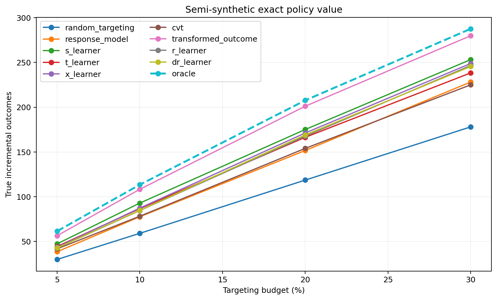

# Semi-Synthetic Uplift Benchmark with Known CATE

## Data-Generating Process

- Covariates: `data/processed/criteo_sample_500k.parquet` (200,000 rows).
- Target control outcome rate: `0.0500`.
- Realized mean control response surface: `0.050000`.
- Realized average CATE: `0.014927`.
- CATE standard deviation: `0.006983`.
- Treatment propensity: `0.5000`.
- Random seed: `42`, which fixes the response surfaces,
  the treatment draw, and every model fitted below.
- The response surfaces contain nonlinear terms and feature interactions.
- Treatment is randomized and both potential-outcome probabilities are known.

## Honest Selection

The model is selected only from out-of-sample development paired AIPW lower confidence bounds
against response targeting at the pre-specified `5.00%`
budget. The selected model is
**transformed_outcome**. All candidates are refit on development data and evaluated
on test only to compare them against known ground truth; this does not change
the development-selected champion.

| policy              | budget_pct | n_targeted | incremental_outcome_rate | standard_error_rate | ci_lower_rate | ci_upper_rate | incremental_outcome | ci_lower  | ci_upper   | benchmark_relative_auuc | difference_vs_response | difference_ci_lower | difference_ci_upper |
| ------------------- | ---------- | ---------- | ------------------------ | ------------------- | ------------- | ------------- | ------------------- | --------- | ---------- | ----------------------- | ---------------------- | ------------------- | ------------------- |
| transformed_outcome | 5.000000   | 8000       | 0.000996                 | 0.000250            | 0.000506      | 0.001486      | 159.377701          | 80.936813 | 237.818589 | 0.008596                | 30.006122              | -80.225885          | 140.238129          |
| cvt                 | 5.000000   | 8000       | 0.000825                 | 0.000243            | 0.000348      | 0.001302      | 132.001248          | 55.726625 | 208.275871 | 0.007139                | 2.629669               | -100.217903         | 105.477242          |
| r_learner           | 5.000000   | 8000       | 0.000725                 | 0.000259            | 0.000216      | 0.001233      | 115.925926          | 34.623721 | 197.228130 | 0.007530                | -13.445653             | -103.922392         | 77.031086           |
| s_learner           | 5.000000   | 8000       | 0.000652                 | 0.000272            | 0.000120      | 0.001184      | 104.320653          | 19.124241 | 189.517065 | 0.007674                | -25.050926             | -113.994558         | 63.892706           |
| dr_learner          | 5.000000   | 8000       | 0.000640                 | 0.000256            | 0.000139      | 0.001141      | 102.384020          | 22.245349 | 182.522691 | 0.007444                | -26.987559             | -118.363610         | 64.388492           |
| t_learner           | 5.000000   | 8000       | 0.000543                 | 0.000271            | 0.000013      | 0.001073      | 86.892302           | 2.037270  | 171.747334 | 0.007220                | -42.479277             | -119.282518         | 34.323965           |
| x_learner           | 5.000000   | 8000       | 0.000596                 | 0.000265            | 0.000076      | 0.001115      | 95.336372           | 12.207486 | 178.465258 | 0.007196                | -34.035206             | -120.431831         | 52.361419           |
| random_targeting    | 5.000000   | 8000       | 0.000630                 | 0.000268            | 0.000104      | 0.001156      | 100.784043          | 16.585296 | 184.982790 | 0.006415                | -28.587536             | -147.918694         | 90.743622           |
| response_model      | 5.000000   | 8000       | 0.000809                 | 0.000285            | 0.000249      | 0.001368      | 129.371579          | 39.845584 | 218.897573 | 0.007117                | nan                    | nan                 | nan                 |

## CATE Recovery

| policy              | pehe     | cate_mae | cate_bias | pearson  | spearman |
| ------------------- | -------- | -------- | --------- | -------- | -------- |
| oracle              | 0.000000 | 0.000000 | 0.000000  | 1.000000 | 1.000000 |
| transformed_outcome | 0.003394 | 0.002426 | -0.000707 | 0.880138 | 0.888789 |
| s_learner           | 0.009205 | 0.005134 | -0.001578 | 0.493514 | 0.641360 |
| x_learner           | 0.014340 | 0.007603 | -0.000687 | 0.382308 | 0.558194 |
| dr_learner          | 0.020373 | 0.009212 | -0.000721 | 0.278499 | 0.506409 |
| r_learner           | 0.020505 | 0.009012 | -0.000810 | 0.270201 | 0.519839 |
| t_learner           | 0.021988 | 0.010919 | -0.000704 | 0.279858 | 0.445294 |
| cvt                 | 0.046063 | 0.019597 | -0.000711 | 0.110854 | 0.293191 |
| response_model      | 0.052398 | 0.048392 | 0.047595  | 0.198331 | 0.353000 |

PEHE, CATE MAE, and bias evaluate score magnitude. Pearson and Spearman
correlations evaluate linear and rank recovery. The response model is included
as an operational ranking baseline, not as a calibrated CATE estimator.

## Exact Policy Value at the Primary Budget

| policy              | budget_pct | n_targeted | true_incremental_outcome | oracle_incremental_outcome | policy_regret | oracle_value_fraction |
| ------------------- | ---------- | ---------- | ------------------------ | -------------------------- | ------------- | --------------------- |
| oracle              | 5.000000   | 2000       | 61.440248                | 61.440248                  | 0.000000      | 1.000000              |
| transformed_outcome | 5.000000   | 2000       | 56.347623                | 61.440248                  | 5.092624      | 0.917113              |
| s_learner           | 5.000000   | 2000       | 47.255324                | 61.440248                  | 14.184923     | 0.769127              |
| t_learner           | 5.000000   | 2000       | 44.345921                | 61.440248                  | 17.094326     | 0.721773              |
| x_learner           | 5.000000   | 2000       | 43.444934                | 61.440248                  | 17.995314     | 0.707109              |
| dr_learner          | 5.000000   | 2000       | 42.670179                | 61.440248                  | 18.770068     | 0.694499              |
| r_learner           | 5.000000   | 2000       | 42.642776                | 61.440248                  | 18.797472     | 0.694053              |
| cvt                 | 5.000000   | 2000       | 41.671594                | 61.440248                  | 19.768654     | 0.678246              |
| response_model      | 5.000000   | 2000       | 38.469703                | 61.440248                  | 22.970545     | 0.626132              |
| random_targeting    | 5.000000   | 2000       | 29.846178                | 61.440248                  | 31.594069     | 0.485776              |

`policy_regret` is the exact difference from targeting the users with the
largest true CATE. `oracle_value_fraction` measures how much of the attainable
oracle gain each ranking captures.

## Observed AIPW Estimate at the Same Budget

| policy              | budget_pct | n_targeted | incremental_outcome_rate | standard_error_rate | ci_lower_rate | ci_upper_rate | incremental_outcome | ci_lower   | ci_upper  |
| ------------------- | ---------- | ---------- | ------------------------ | ------------------- | ------------- | ------------- | ------------------- | ---------- | --------- |
| transformed_outcome | 5.000000   | 2000       | 0.001364                 | 0.000558            | 0.000271      | 0.002457      | 54.573770           | 10.856761  | 98.290779 |
| s_learner           | 5.000000   | 2000       | 0.001293                 | 0.000557            | 0.000201      | 0.002384      | 51.700788           | 8.021715   | 95.379862 |
| response_model      | 5.000000   | 2000       | 0.001266                 | 0.000612            | 0.000066      | 0.002466      | 50.630312           | 2.629482   | 98.631143 |
| cvt                 | 5.000000   | 2000       | 0.001214                 | 0.000478            | 0.000278      | 0.002150      | 48.574964           | 11.135677  | 86.014251 |
| random_targeting    | 5.000000   | 2000       | 0.001206                 | 0.000495            | 0.000236      | 0.002176      | 48.223667           | 9.426820   | 87.020515 |
| x_learner           | 5.000000   | 2000       | 0.000928                 | 0.000513            | -0.000077     | 0.001933      | 37.125095           | -3.089202  | 77.339392 |
| dr_learner          | 5.000000   | 2000       | 0.000705                 | 0.000536            | -0.000346     | 0.001756      | 28.198525           | -13.831630 | 70.228680 |
| r_learner           | 5.000000   | 2000       | 0.000422                 | 0.000532            | -0.000621     | 0.001464      | 16.861669           | -24.838981 | 58.562319 |
| t_learner           | 5.000000   | 2000       | 0.000204                 | 0.000569            | -0.000912     | 0.001320      | 8.164196            | -36.461262 | 52.789654 |

This comparison checks whether the observed-data estimator and its uncertainty
lead to decisions that agree with the known response surfaces.

## Reproducible Outputs

- CATE metrics: `outputs/tables/semisynthetic_cate_metrics.csv`
- Development selection: `outputs/tables/semisynthetic_selection.csv`
- Exact policy values: `outputs/tables/semisynthetic_policy_truth.csv`
