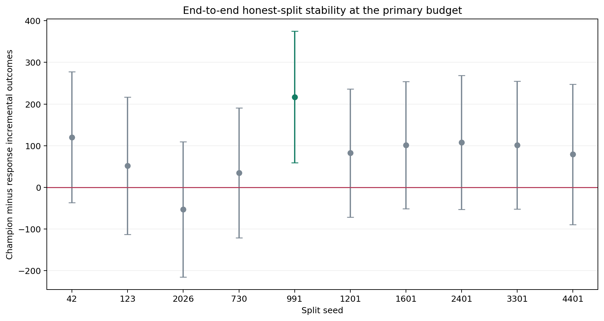

# End-to-End Honest-Split Stability: Criteo visit

## Protocol

- Data: `data/processed/criteo_sample_500k.parquet` (500,000 rows).
- Seeds: `42,123,2026,730,991,1201,1601,2401,3301,4401`.
- Primary budget: `5.00%`.
- Candidate models: `response_model,s_learner,t_learner,x_learner,cvt,transformed_outcome,r_learner,dr_learner`.
- Every run repeats training, out-of-sample model selection, development
  refitting, nuisance estimation, and locked-test evaluation.
- Each run uses the same pre-specified candidate set and selection rule.

## Aggregate Stability

| runs | mean_difference | std_difference | min_difference | max_difference | positive_point_rate | positive_ci_rate | negative_ci_rate |
| ---- | --------------- | -------------- | -------------- | -------------- | ------------------- | ---------------- | ---------------- |
| 10   | 84.339132       | 68.640383      | -52.881427     | 217.035790     | 0.900000            | 0.100000         | 0.000000         |

## Champion Frequency

| champion            | runs | mean_difference | positive_rate |
| ------------------- | ---- | --------------- | ------------- |
| s_learner           | 4    | 112.393987      | 1.000000      |
| x_learner           | 2    | 95.106520       | 1.000000      |
| r_learner           | 2    | 68.086840       | 1.000000      |
| transformed_outcome | 2    | 33.714328       | 0.500000      |

## Results by Split

| seed | champion            | difference_vs_response | ci_lower    | ci_upper   | champion_incremental_outcome | response_incremental_outcome | champion_auuc | response_auuc | fit_seconds |
| ---- | ------------------- | ---------------------- | ----------- | ---------- | ---------------------------- | ---------------------------- | ------------- | ------------- | ----------- |
| 42   | transformed_outcome | 120.310083             | -36.691974  | 277.312139 | 415.193489                   | 294.883406                   | 0.009183      | 0.008924      | 298.234697  |
| 123  | s_learner           | 51.958136              | -113.211759 | 217.128030 | 470.259984                   | 418.301849                   | 0.008331      | 0.008769      | 205.388164  |
| 2026 | transformed_outcome | -52.881427             | -215.461879 | 109.699026 | 455.015309                   | 507.896736                   | 0.009883      | 0.009149      | 202.687958  |
| 730  | r_learner           | 34.714789              | -121.500622 | 190.930200 | 301.094529                   | 266.379740                   | 0.007602      | 0.008877      | 221.920365  |
| 991  | s_learner           | 217.035790             | 58.909340   | 375.162240 | 365.902794                   | 148.867004                   | 0.008362      | 0.008439      | 166.071626  |
| 1201 | x_learner           | 82.385763              | -71.751182  | 236.522709 | 333.400272                   | 251.014508                   | 0.007571      | 0.008480      | 76.474718   |
| 1601 | r_learner           | 101.458890             | -51.245972  | 254.163752 | 438.338445                   | 336.879555                   | 0.008697      | 0.008484      | 97.235636   |
| 2401 | x_learner           | 107.827277             | -52.777004  | 268.431558 | 522.434635                   | 414.607358                   | 0.008682      | 0.008532      | 84.561670   |
| 3301 | s_learner           | 101.272277             | -52.362301  | 254.906854 | 367.392408                   | 266.120131                   | 0.008933      | 0.008660      | 74.510350   |
| 4401 | s_learner           | 79.309746              | -89.165752  | 247.785244 | 443.756213                   | 364.446468                   | 0.008622      | 0.008822      | 74.772600   |

These repeated splits overlap and are therefore correlated robustness checks,
not independent experiments. They measure sensitivity to training and partition
variation; the canonical locked test remains the primary result.

Raw results: `outputs/tables/visit_stability.csv`.
