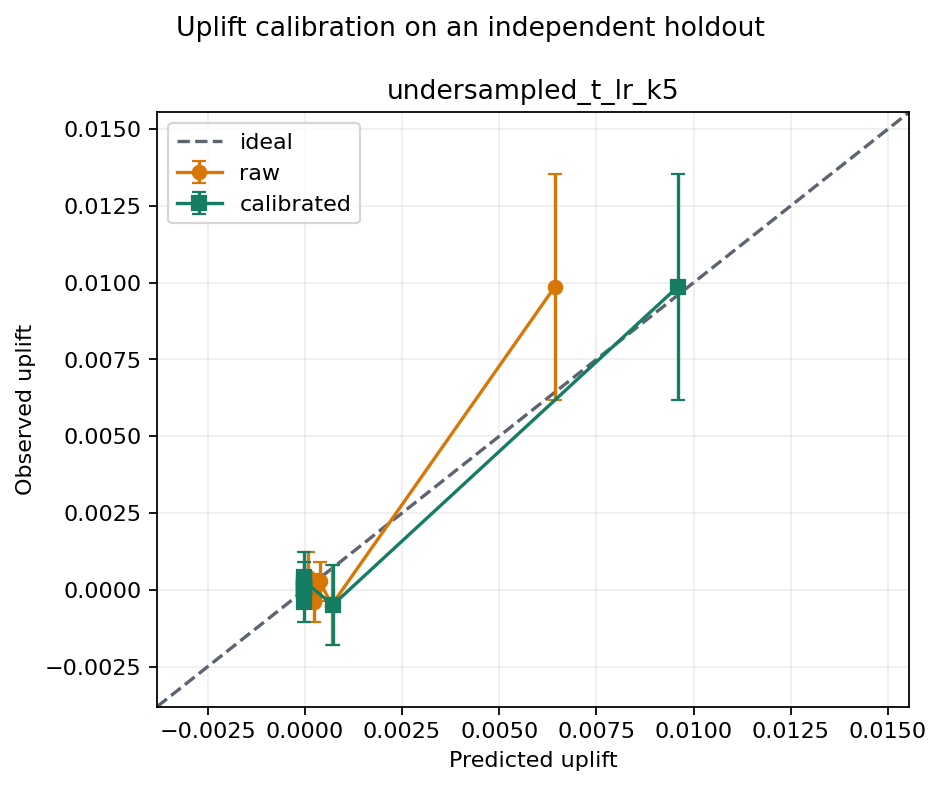

# Uplift-Score Calibration on an Independent Holdout

## Setup

- Data: `data/processed/criteo_sample_2m.parquet` (2,000,000 rows), outcome `conversion`.
- Train/calibration/test: 1,200,000 / 400,000 / 400,000.
- Treatment propensity estimated from training data: `0.849612`.
- Model: `undersampled_t_lr_k5`; random seed `2026`.
- The isotonic calibrator is fitted only on the calibration set using transformed outcomes.
- The calibrator is fitted on `100` weighted quantile groups to reduce pseudo-outcome noise.
- Calibration metrics and threshold policies are evaluated only on the untouched test holdout.

## Calibration Results Summary

| model                | score_version | weighted_bias | weighted_mae | weighted_rmse | euce     | muce     | calibration_intercept | calibration_slope | benchmark_relative_auuc | score_mean | score_min | score_max |
| -------------------- | ------------- | ------------- | ------------ | ------------- | -------- | -------- | --------------------- | ----------------- | ----------------------- | ---------- | --------- | --------- |
| undersampled_t_lr_k5 | raw           | 0.000123      | 0.000629     | 0.001174      | 0.000629 | 0.003435 | -0.000380             | 1.575942          | 0.001067                | 0.000874   | -0.078242 | 0.257441  |
| undersampled_t_lr_k5 | calibrated    | -0.000024     | 0.000298     | 0.000445      | 0.000298 | 0.001210 | -0.000048             | 1.023961          | 0.001070                | 0.001021   | -0.000013 | 0.050958  |

Ideal calibration has an intercept near `0`, a slope near `1`, and errors near
`0`. Based on weighted MAE on the holdout, calibration improves: `undersampled_t_lr_k5`.
Isotonic mapping is monotonic and therefore preserves ordering in principle;
AUUC may change slightly because multiple scores can be mapped to the same value.

## Post-Calibration Groups

| model                | bin | n     | predicted_uplift | observed_uplift | ci_lower  | ci_upper |
| -------------------- | --- | ----- | ---------------- | --------------- | --------- | -------- |
| undersampled_t_lr_k5 | 1   | 40000 | 0.009593         | 0.009865        | 0.006187  | 0.013544 |
| undersampled_t_lr_k5 | 2   | 40000 | 0.000720         | -0.000490       | -0.001798 | 0.000818 |
| undersampled_t_lr_k5 | 3   | 40000 | -0.000013        | 0.000275        | -0.000354 | 0.000905 |
| undersampled_t_lr_k5 | 4   | 40000 | -0.000013        | 0.000129        | -0.000242 | 0.000501 |
| undersampled_t_lr_k5 | 5   | 40000 | -0.000013        | -0.000379       | -0.001034 | 0.000277 |
| undersampled_t_lr_k5 | 6   | 40000 | -0.000013        | 0.000088        | -0.000012 | 0.000189 |
| undersampled_t_lr_k5 | 7   | 40000 | -0.000013        | -0.000046       | -0.000389 | 0.000296 |
| undersampled_t_lr_k5 | 8   | 40000 | -0.000013        | 0.000059        | -0.000023 | 0.000140 |
| undersampled_t_lr_k5 | 9   | 40000 | -0.000013        | 0.000059        | -0.000023 | 0.000140 |
| undersampled_t_lr_k5 | 10  | 40000 | -0.000013        | 0.000410        | -0.000406 | 0.001225 |

Bin 1 contains the group with the highest raw scores. The confidence interval is
a normal approximation for the difference between treatment and control rates
within each bin. All bins are stored at `reports/tables/conversion_uplift_calibration_bins.csv`.

## Policy Based on the Economic Threshold

- Value of one incremental conversion: `100.00`.
- Cost per targeting action: `5.00`.
- Break-even uplift threshold: `0.050000`.

| model                | score_version | score_threshold | target_rate_pct | n_targeted | incremental_outcome | net_value   | profitable |
| -------------------- | ------------- | --------------- | --------------- | ---------- | ------------------- | ----------- | ---------- |
| undersampled_t_lr_k5 | raw           | 0.050000        | 0.157500        | 630        | 38.447323           | 694.732330  | True       |
| undersampled_t_lr_k5 | calibrated    | 0.050000        | 0.317000        | 1268       | 55.596901           | -780.309870 | False      |

Only `calibrated` rows should be used to interpret absolute thresholds. The
monetary scenario remains illustrative; the fixed 5% budget from the stability
analysis is a more reliable choice for the online experiment if calibration is
not sufficiently stable.

## Runtime

| model                | model_fit_seconds | calibrator_fit_seconds |
| -------------------- | ----------------- | ---------------------- |
| undersampled_t_lr_k5 | 0.785202          | 0.230400               |

## Recommendations

- Use the calibration plot to validate score magnitude, not as a replacement for AUUC as a ranking metric.
- Do not select a threshold on the test holdout after reviewing its results.
- Lock the model, calibrator, and threshold before the randomized online experiment.
