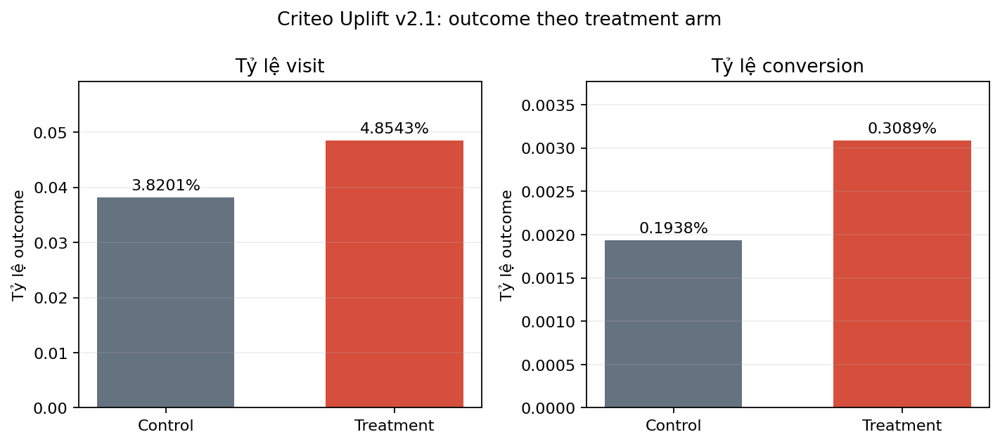

# Criteo Uplift v2.1 — Exploratory Data Analysis

## Configuration

| Item | Value |
|---|---|
| Source | `data/criteo-uplift-v2.1.csv.gz` |
| Development sample | `data/processed/criteo_sample_500k.parquet` |
| Sampling | DuckDB reservoir sampling, seed `42` |
| Primary outcome | `visit` |
| Secondary outcome | `conversion` |

## Dataset Overview

| Data | Rows | Treatment rate | Visit rate | Conversion rate | Exposure rate |
|---|---:|---:|---:|---:|---:|
| Full dataset | 13,979,592 | 0.850000 | 0.046992 | 0.002917 | 0.030631 |
| 500k sample | 500,000 | 0.850104 | 0.047592 | 0.002980 | 0.030636 |

The sample closely preserves the full dataset's treatment and outcome rates.

## Outcomes by Treatment

| Treatment | Rows | Visit rate | Conversion rate | Exposure rate |
|---:|---:|---:|---:|---:|
| 0 | 2,096,937 | 0.038201 | 0.001938 | 0.000000 |
| 1 | 11,882,655 | 0.048543 | 0.003089 | 0.036037 |

| Outcome | Treated rate | Control rate | Observed ATE |
|---|---:|---:|---:|
| Visit | 0.048543 | 0.038201 | 0.010342 |
| Conversion | 0.003089 | 0.001938 | 0.001152 |

## Data Checks

- Features `f0`–`f11` contain no missing values in the development sample.
- Treatment is intentionally imbalanced at approximately 85/15.
- `conversion` is rare and requires a larger sample for stable analysis.
- `exposure` is zero in control and occurs after assignment, so it is excluded to prevent leakage.

## Modeling Decisions

- Use `f0`–`f11` as pre-treatment features.
- Use `visit` as the primary outcome and `conversion` as a robustness outcome.
- Stratify splits jointly by treatment and outcome.
- Use the 500k sample for iteration and the 2m sample for conversion analysis.
