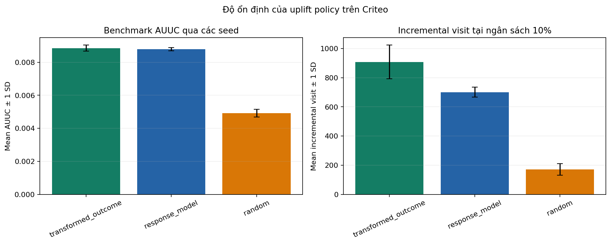
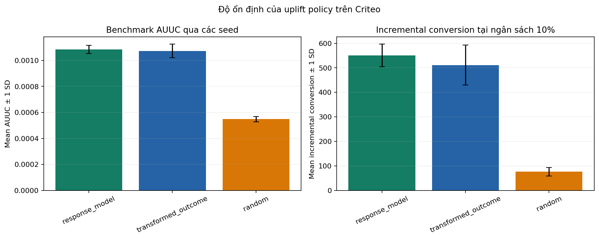

# Uplift Model Evaluation and Selection

## Evaluation Design

- Dataset: Criteo Uplift Prediction Dataset v2.1.
- Features: `f0`–`f11`; `exposure` is excluded.
- Outcomes: `visit` primary, `conversion` secondary.
- Test share: 30%, stratified jointly by treatment and outcome.
- Stability seeds: `42`, `123`, and `2026`.
- Ranking metric: Criteo separate relative AUUC.
- Decision metric: incremental outcome at the same targeting budget.
- Uncertainty: paired bootstrap within treatment and control arms.

The response model is the operational baseline for all deployment comparisons.

## Visit Results

The experiment uses the 500,000-row sample. Values below are averages across three seeds.

| Policy | Mean AUUC | Gain at 5% vs. response | Gain at 10% vs. response | Positive seeds at 10% |
|---|---:|---:|---:|---:|
| MOM | 0.008855 | +285.27 | +207.03 | 3/3 |
| S-learner | 0.008689 | +263.17 | +204.53 | 3/3 |
| Response model | 0.008789 | Reference | Reference | — |

### MOM policy by budget

| Budget | MOM visits | Response visits | Gain | Relative gain |
|---:|---:|---:|---:|---:|
| 5% | 715.40 | 430.13 | +285.27 | +66.32% |
| 10% | 907.78 | 700.76 | +207.03 | +29.54% |
| 20% | 1,073.50 | 1,026.33 | +47.16 | +4.60% |
| 30% | 1,241.09 | 1,222.94 | +18.14 | +1.48% |

### Reference-seed uncertainty

| Budget | MOM gain vs. response | Paired-bootstrap 95% CI |
|---:|---:|---:|
| 5% | +412.87 | [180.03, 632.15] |
| 10% | +336.17 | [86.60, 589.11] |
| 20% | +80.96 | [-123.31, 322.23] |
| 30% | +62.33 | [-122.07, 240.36] |

Evidence is strongest at 5–10%. The intervals at 20–30% include zero.

CVT records `0.007457` AUUC on the reference seed and is not shortlisted.

## Conversion Results

The conversion experiment uses the two-million-row sample.

| Policy | Mean AUUC | Gain at 5% vs. response | Gain at 10% vs. response | Positive seeds at 10% |
|---|---:|---:|---:|---:|
| Response model | 0.001085 | Reference | Reference | — |
| MOM | 0.001073 | -42.85 | -39.63 | 1/3 |
| S-learner | 0.000977 | Below baseline | -59.01 | 0/3 |

On the reference seed, MOM's 10% gain is `-45.85`, with a 95% CI of `[-88.02, -1.86]`. The current models do not support direct uplift optimization for conversion.

## Decision

| Role | Choice | Reason |
|---|---|---|
| Primary visit policy | MOM at 5% | Stable low-budget gain, speed, and simple implementation. |
| Visit challenger | S-learner | Competitive nonlinear ranking. |
| Conversion policy | Response model | Best observed conversion performance. |
| Academic baseline | CVT | Useful comparison, not a deployment candidate. |

The next validation step is a randomized comparison of MOM top 5% against response top 5%. Conversion remains a secondary KPI and guardrail.
