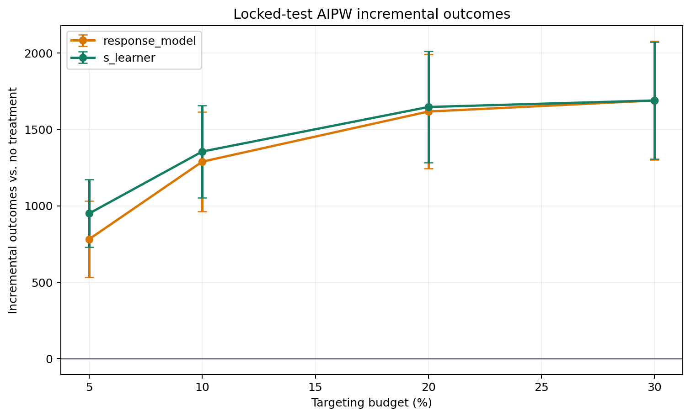
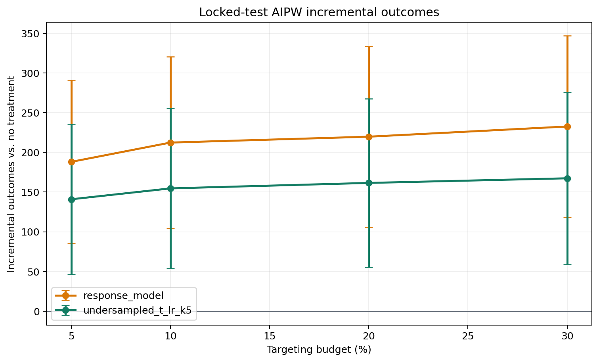

# Campaign Uplift Modeling: Project Report

> **Evidence status:** the locked audit supports an online visit challenger,
> not production rollout. Response targeting remains the conversion policy.

## Project Summary

Uplift models rank users by the outcome change caused by treatment rather than
by outcome probability alone. That distinction is useful only if model
selection and evaluation remain separated. This project compares response
targeting with S-, T-, X-, CVT-, modified-outcome, R-, and doubly robust
learners on the Criteo Uplift Prediction Dataset. The evaluation protocol uses
joint treatment/outcome stratification, out-of-fold development predictions,
paired augmented inverse-propensity weighted (AIPW) policy contrasts, and a
one-million-row audit sample with zero row overlap with development samples.

At a pre-specified 5% visit-targeting budget, the development protocol selected
the S-learner. On the locked 200,000-row audit test, it produced an estimated
168.5 additional visits relative to response targeting, with a 95% confidence
interval of [-53.0, 390.0]. Ten repeated honest splits were positive in nine
runs but only one interval excluded zero. The evidence therefore supports an
online challenger test, not production rollout.

For the rarer conversion outcome, negative-outcome undersampling selected a
logistic T-learner with factor 5. It was worse than response targeting by 47.1
conversions at 5% on the audit test, with a 95% interval of [-104.6, 10.3], and
was significantly worse at 10% through 30% budgets. A semi-synthetic benchmark
with known conditional effects showed that the modified-outcome model recovered
87.8% of oracle value at 5%, while observed-data policy estimates remained
noisy enough to mis-rank candidates. The combined evidence illustrates why
uplift work requires honest selection, budget-specific uncertainty, and live
randomized validation.

## Project Objective

For users eligible for a campaign, does an uplift ranking create more
incremental outcomes than an operational response ranking when both target the
same top 5%?

The primary outcome is `visit`. `conversion` is a secondary, highly imbalanced
outcome and a guardrail. The primary policy contrast is:

```text
Delta = [V(pi_uplift) - V(0)] - [V(pi_response) - V(0)]
      = V(pi_uplift) - V(pi_response)
```

where `pi(X)` is a deterministic top-k targeting rule.

## What Was Built

The implementation adds six safeguards beyond a conventional uplift
benchmark:

1. **Honest model selection.** Candidate policies are selected from
   out-of-fold development predictions, not test outcomes.
2. **A disjoint audit sample.** Complete-row hashes from the 500,000- and
   2,000,000-row development samples are excluded before sampling one million
   audit rows from the 13.98-million-row source.
3. **Paired doubly robust evaluation.** Policy differences are evaluated on the
   same users using AIPW influence scores and confidence intervals.
4. **Modern causal learners.** Cross-fitted R- and doubly robust learners are
   evaluated alongside S-, T-, X-, CVT-, and modified-outcome baselines.
5. **Rare-outcome treatment.** Negative outcomes are undersampled separately by
   treatment arm, with factor selection outside the audit test and probability
   correction before calibration.
6. **Ground-truth stress testing.** A semi-synthetic benchmark on real Criteo
   covariates reports CATE error, exact policy value, and oracle regret.

## Data

The Criteo Uplift Prediction Dataset v2.1 contains 13,979,592 randomized
observations, 12 anonymized pre-treatment features, an approximately 85%
treatment rate, a visit outcome, and a rare conversion outcome. The
post-treatment `exposure` variable is excluded.

| Dataset | Rows | Role |
|---|---:|---|
| `criteo_sample_500k.parquet` | 500,000 | Visit development and repeated-split sensitivity |
| `criteo_sample_2m.parquet` | 2,000,000 | Conversion imbalance selection and calibration |
| `criteo_audit_1m.parquet` | 1,000,000 | Confirmatory audit, zero overlap with both development samples |

The audit sample has treatment, visit, and conversion rates of 84.59%, 4.89%,
and 0.31%, respectively.

## Evaluation Design

### Development selection and locked test

The canonical experiment reserves 20% as a locked test. The remaining 80% is
the development partition. Three joint treatment/outcome-stratified folds
produce out-of-fold scores for every candidate and for the AIPW nuisance
models. Scores are converted to within-fold percentiles before combining folds,
so a fixed top-k budget has the same interpretation across fitted models.

At the 5% budget, the selected uplift policy maximizes the lower endpoint of the
paired 95% AIPW confidence interval against response targeting. The champion
and response model are then refitted on all development data before the test
outcomes are opened.

### AIPW policy value

Let `e` be the randomized treatment propensity and let `mu_t(X)` estimate the
outcome under treatment state `t`. The AIPW treatment-effect score is:

```text
phi =
    mu_1(X) - mu_0(X)
    + T / e * [Y - mu_1(X)]
    - (1 - T) / (1 - e) * [Y - mu_0(X)]
```

The incremental value of a policy is the sample mean of `pi(X) * phi`. The
paired uplift-versus-response contrast uses:

```text
[pi_uplift(X) - pi_response(X)] * phi
```

This pairing measures the actual disagreement between the two policies and is
more precise than subtracting two independent estimates.

### Candidate learners

| Model | Role |
|---|---|
| Response model | Operational baseline; ranks treated-user response probability |
| S-learner | One outcome model with treatment as a feature |
| T-learner | Separate treated and control outcome models |
| X-learner | Imputed treatment effects with second-stage effect models |
| CVT | Treatment/outcome class transformation with propensity correction |
| Modified outcome | Regresses a propensity-adjusted pseudo-outcome |
| R-learner | Cross-fitted residual-on-residual effect learning |
| DR-learner | Cross-fitted doubly robust pseudo-outcome regression |

AUUC is reported as a full-ranking diagnostic. It is not the selection
criterion because the campaign decision is budget-specific.

## Visit Result

### Development selection

On 800,000 audit development observations, the S-learner had the strongest
lower confidence bound at 5%. Its estimated advantage over response targeting
was 1,001.1 visits with a 95% interval of [565.3, 1,436.9]. This result selected
the policy; it is not the confirmatory effect estimate.

### Locked audit test

| Budget | S-learner incremental visits | Response incremental visits | Paired difference | 95% CI |
|---:|---:|---:|---:|---:|
| 5% | 949.8 | 781.3 | +168.5 | [-53.0, 390.0] |
| 10% | 1,355.4 | 1,289.1 | +66.3 | [-114.8, 247.4] |
| 20% | 1,647.3 | 1,617.5 | +29.8 | [-76.6, 136.2] |
| 30% | 1,689.8 | 1,689.7 | +0.1 | [-83.2, 83.4] |

The pre-specified 5% point estimate is favorable but inconclusive. The
S-learner also has slightly lower full-ranking AUUC than response
(`0.010943` versus `0.011249`), showing that the local top-5% decision and the
global ranking metric need not agree.



### Repeated-split sensitivity

Ten complete train/validation/test repetitions on the 500,000-row development
sample retrained and re-evaluated the already locked S-learner against response
targeting. S was the only uplift challenger in this sensitivity analysis; it
was not a second model-selection exercise. The paired 5% point estimate was
positive in nine runs.

| Statistic | Value |
|---|---:|
| Mean difference per 100,000-user test | +93.6 visits |
| Standard deviation | 62.7 |
| Range | -37.7 to +183.1 |
| Positive point-estimate rate | 90% |
| Positive 95% CI rate | 10% |
| Negative 95% CI rate | 0% |

The direction is reasonably stable, but interval evidence is weak. These
overlapping splits are correlated sensitivity analyses, not ten independent
experiments.

## Conversion Result

### Imbalance handling

For factors `1, 5, 10, 25, 50, 100, 200`, negative outcomes are sampled
separately within treatment and control while all positives are retained. The
T-learner receives exact case-control prior correction using realized keep
rates. Factor 1 is the no-undersampling control.

On the two-million-row development sample, the conservative selection rule
chose `undersampled_t_lr_k5`. Its development advantage was still negative:
-35.7 conversions, with a 95% interval of [-131.8, 60.3]. The internal holdout
was essentially tied at 5%: -2.5 conversions, [-55.3, 50.3].

### Locked audit test

| Budget | T-learner k=5 minus response | 95% CI |
|---:|---:|---:|
| 5% | -47.1 | [-104.6, 10.3] |
| 10% | -57.7 | [-106.1, -9.4] |
| 20% | -58.2 | [-100.6, -15.9] |
| 30% | -65.2 | [-106.8, -23.7] |

Response targeting remains the conversion policy. The rare-outcome intervention
improves model training and score calibration, but does not create policy value
relative to the operational baseline.



Independent isotonic calibration reduced expected uplift calibration error
from `0.000629` to `0.000298` and moved calibration slope from `1.576` to
`1.024`. This is a magnitude improvement, not evidence of better ranking.

## Ground-Truth Check

Real Criteo covariates are combined with nonlinear response surfaces,
interactions, and both positive and negative treatment-effect heterogeneity.
Treatment is randomized, while `mu_0(X)`, `mu_1(X)`, and the true CATE are
known.

At 5%, the modified-outcome model is the strongest feasible policy:

| Policy | PEHE | Spearman with true CATE | True incremental outcomes | Oracle fraction |
|---|---:|---:|---:|---:|
| Oracle | 0.0000 | 1.000 | 61.61 | 100.0% |
| Modified outcome | 0.0043 | 0.850 | 54.08 | 87.8% |
| S-learner | 0.0102 | 0.605 | 45.97 | 74.6% |
| Response | 0.0536 | 0.304 | 39.83 | 64.6% |

The three-fold development rule selected CVT by the least-negative paired lower
bound (`-83.9` outcomes); no candidate had a positive lower bound. CVT captured
only 69.1% of oracle value and ranked below the modified-outcome, S-, X-, and
T-learners under the known response surface. Observed AIPW values on the finite
locked test also failed to preserve the true order: the X-learner appeared
strongest, while the genuinely strongest modified-outcome model appeared much
lower. This is direct evidence that noisy observed policy value can select the
wrong model even when the estimator is unbiased asymptotically. Larger samples,
cross-fitting, conservative selection, and an untouched audit are therefore
substantive requirements rather than presentation details.

## What Changed from the First Iteration

The earlier workflow reported a 66.3% visit improvement for the
modified-outcome model at 5%. Candidate selection and effect reporting reused
the same test evidence, so that number is an exploratory upper-biased estimate.
It is documented here only to explain the change in conclusion; legacy outputs
are not part of the evidence package.

The confirmatory headline is:

> The locked audit estimate favors S-learner targeting by 168.5 visits at a 5%
> budget, but the 95% interval [-53.0, 390.0] remains inconclusive.

This conclusion is less dramatic and more decision-useful.

## Online Validation Plan

The proposed randomized test assigns eligible users to complete policy arms
before ranking. Arm A uses the S-learner, arm B uses response targeting, and arm
H receives no campaign. A and B each target their top 5%; the analysis compares
visit rates across all users assigned to the arms, preserving intention to
treat.

Planning for 75% retention of the offline A-B effect, 80% power, a two-sided
5% type-I error rate, and a 15% operational buffer requires:

| Arm | Policy | Users |
|---|---|---:|
| A | S-learner, top 5% | 1,837,713 |
| B | Response, top 5% | 1,837,713 |
| H | No-campaign holdout | 80,106 |
| **Total** |  | **3,755,532** |

The primary estimand is the A-B visit-rate difference. Conversion, opt-out,
complaints, contact frequency, and net value are guardrails. No early stopping
based on unadjusted p-values is permitted.

## Current Decision

- **Visit:** advance the locked S-learner to a powered randomized challenger
  test; do not roll it out based on offline evidence alone.
- **Conversion:** retain response targeting; the selected rare-outcome uplift
  candidate is inferior on audit.
- **Economics:** do not claim profit until real outcome value and contact cost
  replace illustrative inputs.
- **Monitoring:** re-check overlap, treatment propensity, calibration, score
  drift, policy overlap, and guardrails before launch.

## Limitations

- The Criteo features are anonymized, limiting mechanism interpretation.
- AIPW intervals condition on fitted policies and do not fully integrate model
  selection uncertainty.
- Repeated splits overlap and are not independent replications.
- The audit uses a large disjoint sample from the same source population, not a
  future temporal cohort.
- Semi-synthetic conclusions depend on the chosen response surface.
- Offline randomized data evaluates policy value under the benchmark treatment;
  production delivery, interference, and logging can differ.

## Project Artifacts

Primary artifacts:

- [Evaluation protocol](evaluation_protocol.md)
- [Decision log](decision_log.md)
- [Audit construction](audit_sample.md)
- [Visit audit](audit_visit_evaluation.md)
- [Visit stability](visit_stability.md)
- [Conversion development](rare_conversion_development.md)
- [Conversion audit](audit_conversion_evaluation.md)
- [Conversion calibration](conversion_uplift_calibration.md)
- [Semi-synthetic benchmark](semisynthetic_benchmark.md)
- [Online experiment design](online_experiment_design.md)

## Technical Foundations

Three references anchor the external data and the two method families most
important to the final decision:

1. [Diemert et al. (2021)](https://arxiv.org/abs/2111.10106) provides the
   randomized Criteo dataset and benchmark setting.
2. [Künzel et al. (2019)](https://arxiv.org/abs/1706.03461) provides the S-, T-,
   and X-learner framework.
3. [Nyberg, Kuśmierczyk, and Klami (2021)](https://proceedings.mlr.press/v157/nyberg21a.html)
   motivates treatment-stratified undersampling and calibration for the rare
   conversion outcome.

The references are implementation anchors rather than an exhaustive literature
review. The audit split, fixed 5% budget, model-selection rule, paired
confidence-bound criterion, semi-synthetic response surface, online experiment
design, and all project conclusions were developed within this repository.
