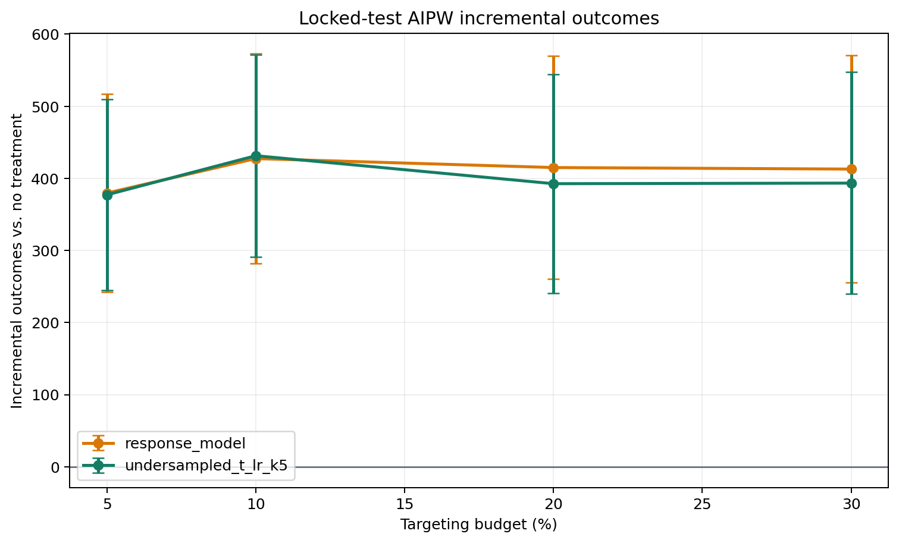

# Honest Uplift Model Selection: Criteo conversion

## Locked Protocol

- Data: `data/processed/criteo_sample_2m.parquet` (2,000,000 rows), outcome `conversion`.
- Base train/validation/test fractions: `0.60` / `0.20` / `0.20`.
- Selection folds: `3` over `1,600,000` selection observations.
- Primary targeting budget: `5.00%`.
- Confidence level: `95.0%`.
- Candidate model and hyperparameter selection uses 3-fold out-of-fold predictions on the combined development sample; locked-test outcomes are excluded.
- The champion is the candidate with the largest paired AIPW lower confidence bound against response targeting at the primary budget.
- After selection, the champion and response baseline are refit on train + validation.
- Locked-test outcomes are opened once for the final comparison.

## Out-of-Sample Development Selection

| policy                   | budget_pct | n_targeted | incremental_outcome_rate | standard_error_rate | ci_lower_rate | ci_upper_rate | incremental_outcome | ci_lower   | ci_upper    | benchmark_relative_auuc | difference_vs_response | difference_ci_lower | difference_ci_upper |
| ------------------------ | ---------- | ---------- | ------------------------ | ------------------- | ------------- | ------------- | ------------------- | ---------- | ----------- | ----------------------- | ---------------------- | ------------------- | ------------------- |
| undersampled_t_lr_k5     | 5.000000   | 80000      | 0.000745                 | 0.000091            | 0.000566      | 0.000924      | 1192.351356         | 905.553736 | 1479.148977 | 0.001046                | -35.715153             | -131.763154         | 60.332848           |
| undersampled_t_lr_k1     | 5.000000   | 80000      | 0.000701                 | 0.000090            | 0.000524      | 0.000878      | 1121.429138         | 838.349540 | 1404.508737 | 0.000999                | -106.637371            | -213.523457         | 0.248715            |
| undersampled_t_lr_k50    | 5.000000   | 80000      | 0.000693                 | 0.000091            | 0.000515      | 0.000872      | 1109.491707         | 823.209259 | 1395.774155 | 0.001005                | -118.574802            | -220.524732         | -16.624873          |
| undersampled_t_lr_k100   | 5.000000   | 80000      | 0.000655                 | 0.000086            | 0.000487      | 0.000823      | 1048.340107         | 779.237006 | 1317.443208 | 0.000922                | -179.726402            | -324.925792         | -34.527013          |
| undersampled_cvt_lr_k25  | 5.000000   | 80000      | 0.000626                 | 0.000087            | 0.000455      | 0.000798      | 1001.782446         | 727.485739 | 1276.079153 | 0.000936                | -226.284064            | -364.029066         | -88.539061          |
| undersampled_t_lr_k10    | 5.000000   | 80000      | 0.000609                 | 0.000086            | 0.000442      | 0.000777      | 975.025779          | 706.786029 | 1243.265530 | 0.000972                | -253.040730            | -395.753427         | -110.328033         |
| undersampled_t_lr_k25    | 5.000000   | 80000      | 0.000568                 | 0.000087            | 0.000398      | 0.000739      | 909.247243          | 636.234461 | 1182.260026 | 0.000929                | -318.819266            | -454.162437         | -183.476095         |
| undersampled_cvt_lr_k50  | 5.000000   | 80000      | 0.000547                 | 0.000078            | 0.000394      | 0.000701      | 875.799938          | 629.825381 | 1121.774495 | 0.000979                | -352.266571            | -532.512079         | -172.021064         |
| undersampled_t_lr_k200   | 5.000000   | 80000      | 0.000453                 | 0.000072            | 0.000312      | 0.000595      | 725.378910          | 498.711561 | 952.046258  | 0.000724                | -502.687600            | -709.565475         | -295.809724         |
| undersampled_cvt_lr_k100 | 5.000000   | 80000      | 0.000460                 | 0.000065            | 0.000332      | 0.000587      | 735.713354          | 531.751642 | 939.675067  | 0.000978                | -492.353155            | -721.858616         | -262.847694         |
| undersampled_cvt_lr_k10  | 5.000000   | 80000      | 0.000381                 | 0.000076            | 0.000232      | 0.000530      | 610.139505          | 371.796857 | 848.482152  | 0.000626                | -617.927005            | -804.269849         | -431.584161         |
| undersampled_cvt_lr_k5   | 5.000000   | 80000      | 0.000266                 | 0.000071            | 0.000127      | 0.000405      | 425.116004          | 202.822535 | 647.409472  | 0.000492                | -802.950506            | -1003.319377        | -602.581635         |
| undersampled_cvt_lr_k200 | 5.000000   | 80000      | 0.000236                 | 0.000046            | 0.000147      | 0.000325      | 377.559411          | 234.421215 | 520.697607  | 0.000732                | -850.507098            | -1124.737402        | -576.276795         |
| undersampled_cvt_lr_k1   | 5.000000   | 80000      | 0.000195                 | 0.000059            | 0.000079      | 0.000311      | 311.621135          | 126.154156 | 497.088114  | 0.000383                | -916.445374            | -1147.086062        | -685.804687         |
| response_model           | 5.000000   | 80000      | 0.000768                 | 0.000093            | 0.000585      | 0.000950      | 1228.066509         | 935.507948 | 1520.625071 | 0.001071                | nan                    | nan                 | nan                 |

Selected champion: **undersampled_t_lr_k5**.

## Locked-Test Policy Value

| policy               | budget_pct | n_targeted | incremental_outcome_rate | standard_error_rate | ci_lower_rate | ci_upper_rate | incremental_outcome | ci_lower   | ci_upper   |
| -------------------- | ---------- | ---------- | ------------------------ | ------------------- | ------------- | ------------- | ------------------- | ---------- | ---------- |
| response_model       | 5.000000   | 20000      | 0.000949                 | 0.000175            | 0.000606      | 0.001292      | 379.621171          | 242.299598 | 516.942743 |
| response_model       | 10.000000  | 40000      | 0.001069                 | 0.000185            | 0.000705      | 0.001432      | 427.415920          | 282.008088 | 572.823751 |
| response_model       | 20.000000  | 80000      | 0.001037                 | 0.000197            | 0.000651      | 0.001423      | 414.954472          | 260.514271 | 569.394673 |
| response_model       | 30.000000  | 120000     | 0.001032                 | 0.000201            | 0.000639      | 0.001426      | 412.830917          | 255.458462 | 570.203372 |
| undersampled_t_lr_k5 | 5.000000   | 20000      | 0.000943                 | 0.000169            | 0.000612      | 0.001273      | 377.126533          | 244.981347 | 509.271718 |
| undersampled_t_lr_k5 | 10.000000  | 40000      | 0.001078                 | 0.000179            | 0.000728      | 0.001429      | 431.376060          | 291.067649 | 571.684471 |
| undersampled_t_lr_k5 | 20.000000  | 80000      | 0.000981                 | 0.000194            | 0.000602      | 0.001361      | 392.562048          | 240.806647 | 544.317449 |
| undersampled_t_lr_k5 | 30.000000  | 120000     | 0.000983                 | 0.000196            | 0.000599      | 0.001368      | 393.364753          | 239.482459 | 547.247046 |

## Paired Contrast Against Response Targeting

| policy               | reference_policy | budget_pct | n_targeted | difference_rate | standard_error_rate | difference | ci_lower   | ci_upper  |
| -------------------- | ---------------- | ---------- | ---------- | --------------- | ------------------- | ---------- | ---------- | --------- |
| undersampled_t_lr_k5 | response_model   | 5.000000   | 20000      | -0.000006       | 0.000067            | -2.494638  | -55.291818 | 50.302542 |
| undersampled_t_lr_k5 | response_model   | 10.000000  | 40000      | 0.000010        | 0.000064            | 3.960141   | -46.555886 | 54.476168 |
| undersampled_t_lr_k5 | response_model   | 20.000000  | 80000      | -0.000056       | 0.000056            | -22.392424 | -66.350336 | 21.565488 |
| undersampled_t_lr_k5 | response_model   | 30.000000  | 120000     | -0.000049       | 0.000060            | -19.466164 | -66.195139 | 27.262811 |

At the pre-specified `5.00%` budget, the locked test
was inconclusive relative to response targeting. The estimated difference is `-2.4946`
incremental conversion outcomes with a confidence interval of
`[-55.2918, 50.3025]`.

## Ranking Metrics

| policy               | benchmark_relative_auuc |
| -------------------- | ----------------------- |
| response_model       | 0.001129                |
| undersampled_t_lr_k5 | 0.001064                |

AUUC is secondary. The decision is based on the budget-specific AIPW policy
contrast because the campaign has a fixed operating budget.

## Runtime

| stage            | model                    | fit_seconds |
| ---------------- | ------------------------ | ----------- |
| selection_fold_1 | response_model           | 37.849360   |
| selection_fold_1 | undersampled_t_lr_k1     | 4.317004    |
| selection_fold_1 | undersampled_cvt_lr_k1   | 2.438640    |
| selection_fold_1 | undersampled_t_lr_k5     | 0.950746    |
| selection_fold_1 | undersampled_cvt_lr_k5   | 0.639556    |
| selection_fold_1 | undersampled_t_lr_k10    | 0.538231    |
| selection_fold_1 | undersampled_cvt_lr_k10  | 0.369211    |
| selection_fold_1 | undersampled_t_lr_k25    | 0.289948    |
| selection_fold_1 | undersampled_cvt_lr_k25  | 0.236246    |
| selection_fold_1 | undersampled_t_lr_k50    | 0.223771    |
| selection_fold_1 | undersampled_cvt_lr_k50  | 0.197706    |
| selection_fold_1 | undersampled_t_lr_k100   | 0.174451    |
| selection_fold_1 | undersampled_cvt_lr_k100 | 0.156934    |
| selection_fold_1 | undersampled_t_lr_k200   | 0.166834    |
| selection_fold_1 | undersampled_cvt_lr_k200 | 0.151513    |
| selection_fold_1 | aipw_nuisance_t_learner  | 38.838638   |
| selection_fold_2 | response_model           | 33.206763   |
| selection_fold_2 | undersampled_t_lr_k1     | 4.641667    |
| selection_fold_2 | undersampled_cvt_lr_k1   | 2.651887    |
| selection_fold_2 | undersampled_t_lr_k5     | 0.976956    |
| selection_fold_2 | undersampled_cvt_lr_k5   | 0.680133    |
| selection_fold_2 | undersampled_t_lr_k10    | 0.555766    |
| selection_fold_2 | undersampled_cvt_lr_k10  | 0.374479    |
| selection_fold_2 | undersampled_t_lr_k25    | 0.319961    |
| selection_fold_2 | undersampled_cvt_lr_k25  | 0.236830    |
| selection_fold_2 | undersampled_t_lr_k50    | 0.220461    |
| selection_fold_2 | undersampled_cvt_lr_k50  | 0.164383    |
| selection_fold_2 | undersampled_t_lr_k100   | 0.181897    |
| selection_fold_2 | undersampled_cvt_lr_k100 | 0.161294    |
| selection_fold_2 | undersampled_t_lr_k200   | 0.173725    |
| selection_fold_2 | undersampled_cvt_lr_k200 | 0.156433    |
| selection_fold_2 | aipw_nuisance_t_learner  | 35.334611   |
| selection_fold_3 | response_model           | 33.716063   |
| selection_fold_3 | undersampled_t_lr_k1     | 4.243675    |
| selection_fold_3 | undersampled_cvt_lr_k1   | 2.705463    |
| selection_fold_3 | undersampled_t_lr_k5     | 0.922021    |
| selection_fold_3 | undersampled_cvt_lr_k5   | 0.663760    |
| selection_fold_3 | undersampled_t_lr_k10    | 0.500441    |
| selection_fold_3 | undersampled_cvt_lr_k10  | 0.349836    |
| selection_fold_3 | undersampled_t_lr_k25    | 0.288117    |
| selection_fold_3 | undersampled_cvt_lr_k25  | 0.228852    |
| selection_fold_3 | undersampled_t_lr_k50    | 0.219991    |
| selection_fold_3 | undersampled_cvt_lr_k50  | 0.191656    |
| selection_fold_3 | undersampled_t_lr_k100   | 0.194876    |
| selection_fold_3 | undersampled_cvt_lr_k100 | 0.180437    |
| selection_fold_3 | undersampled_t_lr_k200   | 0.171227    |
| selection_fold_3 | undersampled_cvt_lr_k200 | 0.144197    |
| selection_fold_3 | aipw_nuisance_t_learner  | 40.366165   |
| locked_test      | response_model           | 48.100189   |
| locked_test      | undersampled_t_lr_k5     | 1.394249    |
| locked_test      | aipw_nuisance_t_learner  | 60.180868   |

## Statistical Scope

The AIPW intervals account for evaluation-sample uncertainty conditional on the
locked fitted policies. Repeated honest splits are required to quantify training
and selection instability. No production-impact claim is made without a live
randomized experiment.

## Reproducible Outputs

- Selection values: `reports/tables/rare_conversion_selection.csv`
- Locked-test values: `reports/tables/rare_conversion_internal_holdout.csv`
- Paired contrasts: `reports/tables/rare_conversion_internal_contrasts.csv`
