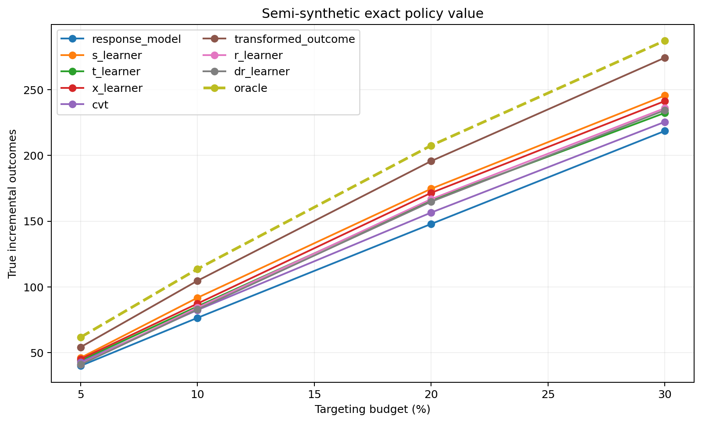

# Semi-Synthetic Uplift Benchmark with Known CATE

## Data-Generating Process

- Covariates: `data/processed/criteo_sample_500k.parquet` (200,000 rows).
- Target control outcome rate: `0.0500`.
- Realized mean control response surface: `0.050000`.
- Realized average CATE: `0.014927`.
- CATE standard deviation: `0.006987`.
- Treatment propensity: `0.5000`.
- The response surfaces contain nonlinear terms and feature interactions.
- Treatment is randomized and both potential-outcome probabilities are known.

## Honest Selection

The model is selected only from out-of-sample development paired AIPW lower confidence bounds
against response targeting at the pre-specified `5.00%`
budget. The selected model is
**cvt**. All candidates are refit on development data and evaluated
on test only to compare them against known ground truth; this does not change
the development-selected champion.

| policy              | budget_pct | n_targeted | incremental_outcome_rate | standard_error_rate | ci_lower_rate | ci_upper_rate | incremental_outcome | ci_lower   | ci_upper   | benchmark_relative_auuc | difference_vs_response | difference_ci_lower | difference_ci_upper |
| ------------------- | ---------- | ---------- | ------------------------ | ------------------- | ------------- | ------------- | ------------------- | ---------- | ---------- | ----------------------- | ---------------------- | ------------------- | ------------------- |
| cvt                 | 5.000000   | 8000       | 0.001479                 | 0.000244            | 0.001002      | 0.001957      | 236.680501          | 160.284312 | 313.076690 | 0.008024                | 24.434275              | -83.929800          | 132.798351          |
| t_learner           | 5.000000   | 8000       | 0.001276                 | 0.000277            | 0.000734      | 0.001818      | 204.089575          | 117.364585 | 290.814565 | 0.008495                | -8.156651              | -86.438475          | 70.125173           |
| dr_learner          | 5.000000   | 8000       | 0.001329                 | 0.000268            | 0.000804      | 0.001853      | 212.590626          | 128.656651 | 296.524600 | 0.008658                | 0.344400               | -93.547357          | 94.236157           |
| s_learner           | 5.000000   | 8000       | 0.001203                 | 0.000277            | 0.000659      | 0.001746      | 192.434019          | 105.508996 | 279.359043 | 0.008674                | -19.812207             | -111.725045         | 72.100631           |
| r_learner           | 5.000000   | 8000       | 0.001171                 | 0.000264            | 0.000654      | 0.001688      | 187.391501          | 104.700067 | 270.082936 | 0.008514                | -24.854724             | -118.426765         | 68.717317           |
| transformed_outcome | 5.000000   | 8000       | 0.001135                 | 0.000255            | 0.000634      | 0.001635      | 181.525099          | 101.457615 | 261.592584 | 0.009696                | -30.721126             | -141.983513         | 80.541260           |
| x_learner           | 5.000000   | 8000       | 0.000984                 | 0.000270            | 0.000454      | 0.001514      | 157.453950          | 72.703836  | 242.204064 | 0.008433                | -54.792276             | -143.174609         | 33.590057           |
| response_model      | 5.000000   | 8000       | 0.001327                 | 0.000290            | 0.000758      | 0.001895      | 212.246226          | 121.343662 | 303.148790 | 0.008391                | nan                    | nan                 | nan                 |

## CATE Recovery

| policy              | pehe     | cate_mae | cate_bias | pearson  | spearman |
| ------------------- | -------- | -------- | --------- | -------- | -------- |
| oracle              | 0.000000 | 0.000000 | 0.000000  | 1.000000 | 1.000000 |
| transformed_outcome | 0.004314 | 0.003273 | 0.000292  | 0.827801 | 0.849647 |
| s_learner           | 0.010245 | 0.006022 | -0.000739 | 0.483565 | 0.605386 |
| x_learner           | 0.013922 | 0.008142 | 0.000228  | 0.414619 | 0.528362 |
| dr_learner          | 0.021093 | 0.010488 | 0.000271  | 0.280307 | 0.462513 |
| r_learner           | 0.021767 | 0.010776 | 0.000290  | 0.274446 | 0.454909 |
| t_learner           | 0.022214 | 0.011610 | 0.000247  | 0.273686 | 0.401434 |
| cvt                 | 0.046147 | 0.020049 | 0.000469  | 0.163601 | 0.393217 |
| response_model      | 0.053592 | 0.048954 | 0.048203  | 0.205221 | 0.303814 |

PEHE, CATE MAE, and bias evaluate score magnitude. Pearson and Spearman
correlations evaluate linear and rank recovery. The response model is included
as an operational ranking baseline, not as a calibrated CATE estimator.

## Exact Policy Value at the Primary Budget

| policy              | budget_pct | n_targeted | true_incremental_outcome | oracle_incremental_outcome | policy_regret | oracle_value_fraction |
| ------------------- | ---------- | ---------- | ------------------------ | -------------------------- | ------------- | --------------------- |
| oracle              | 5.000000   | 2000       | 61.608541                | 61.608541                  | 0.000000      | 1.000000              |
| transformed_outcome | 5.000000   | 2000       | 54.075869                | 61.608541                  | 7.532672      | 0.877733              |
| s_learner           | 5.000000   | 2000       | 45.973876                | 61.608541                  | 15.634665     | 0.746226              |
| x_learner           | 5.000000   | 2000       | 44.995294                | 61.608541                  | 16.613247     | 0.730342              |
| t_learner           | 5.000000   | 2000       | 43.794202                | 61.608541                  | 17.814339     | 0.710846              |
| cvt                 | 5.000000   | 2000       | 42.573725                | 61.608541                  | 19.034816     | 0.691036              |
| r_learner           | 5.000000   | 2000       | 41.079241                | 61.608541                  | 20.529300     | 0.666778              |
| dr_learner          | 5.000000   | 2000       | 40.828758                | 61.608541                  | 20.779783     | 0.662713              |
| response_model      | 5.000000   | 2000       | 39.825221                | 61.608541                  | 21.783319     | 0.646424              |

`policy_regret` is the exact difference from targeting the users with the
largest true CATE. `oracle_value_fraction` measures how much of the attainable
oracle gain each ranking captures.

## Observed AIPW Estimate at the Same Budget

| policy              | budget_pct | n_targeted | incremental_outcome_rate | standard_error_rate | ci_lower_rate | ci_upper_rate | incremental_outcome | ci_lower  | ci_upper   |
| ------------------- | ---------- | ---------- | ------------------------ | ------------------- | ------------- | ------------- | ------------------- | --------- | ---------- |
| x_learner           | 5.000000   | 2000       | 0.002294                 | 0.000530            | 0.001256      | 0.003332      | 91.771677           | 50.258033 | 133.285322 |
| s_learner           | 5.000000   | 2000       | 0.001999                 | 0.000533            | 0.000954      | 0.003044      | 79.952432           | 38.151803 | 121.753062 |
| t_learner           | 5.000000   | 2000       | 0.001988                 | 0.000545            | 0.000919      | 0.003057      | 79.519982           | 36.761394 | 122.278570 |
| response_model      | 5.000000   | 2000       | 0.001762                 | 0.000570            | 0.000644      | 0.002880      | 70.493705           | 25.771324 | 115.216086 |
| dr_learner          | 5.000000   | 2000       | 0.001615                 | 0.000536            | 0.000565      | 0.002665      | 64.607006           | 22.614862 | 106.599149 |
| cvt                 | 5.000000   | 2000       | 0.001399                 | 0.000486            | 0.000448      | 0.002351      | 55.978000           | 17.915333 | 94.040667  |
| r_learner           | 5.000000   | 2000       | 0.001304                 | 0.000532            | 0.000261      | 0.002347      | 52.166117           | 10.448006 | 93.884227  |
| transformed_outcome | 5.000000   | 2000       | 0.001142                 | 0.000519            | 0.000126      | 0.002159      | 45.682479           | 5.023674  | 86.341283  |

This comparison checks whether the observed-data estimator and its uncertainty
lead to decisions that agree with the known response surfaces.

## Reproducible Outputs

- CATE metrics: `reports/tables/semisynthetic_cate_metrics.csv`
- Development selection: `reports/tables/semisynthetic_selection.csv`
- Exact policy values: `reports/tables/semisynthetic_policy_truth.csv`
