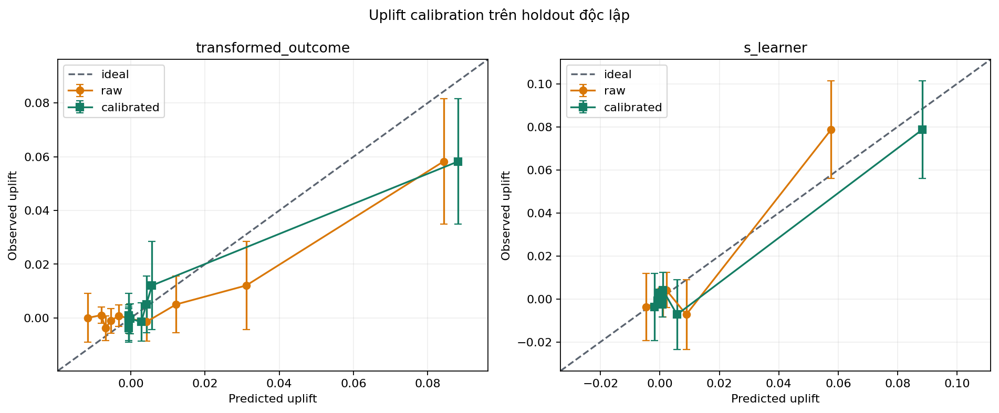

# Uplift-Score Calibration

## Design

| Item | Value |
|---|---|
| Data | Criteo 500k sample, outcome `visit` |
| Split | 60% train / 20% calibration / 20% test |
| Models | MOM and S-learner |
| Calibrator | Isotonic regression |
| Calibration targets | Transformed outcomes grouped into 100 weighted quantiles |
| Evaluation | Untouched test holdout |

Grouping reduces the variance of individual pseudo-outcomes. The test set is used only for final evaluation.

## Calibration Results

| Model | Score | Weighted bias | Weighted MAE | Weighted RMSE | Relative AUUC |
|---|---|---:|---:|---:|---:|
| MOM | Raw | -0.002564 | 0.009010 | 0.011774 | 0.009226 |
| MOM | Calibrated | -0.002713 | 0.004885 | 0.009869 | 0.009237 |
| S-learner | Raw | 0.000677 | 0.005042 | 0.008567 | 0.009277 |
| S-learner | Calibrated | -0.002184 | 0.003839 | 0.005517 | 0.009236 |

Calibration reduces holdout magnitude error while leaving ranking almost unchanged.

Running `scripts/analyze_uplift_calibration.py` exports the detailed bins to `tables/uplift_calibration_bins.csv`.

## Economic Threshold Example

Assume one incremental visit is worth `100` units and one contact costs `5` units. The break-even uplift threshold is therefore `0.05`.

| Model | Score | Target rate | Users targeted | Incremental visits | Net value |
|---|---|---:|---:|---:|---:|
| MOM | Raw | 9.130% | 9,130 | 555.73 | 9,923.29 |
| MOM | Calibrated | 5.365% | 5,365 | 517.49 | 24,924.19 |
| S-learner | Raw | 4.288% | 4,288 | 448.12 | 23,371.78 |
| S-learner | Calibrated | 4.698% | 4,698 | 478.15 | 24,324.99 |

Only calibrated scores should be interpreted as absolute thresholds. The monetary inputs remain illustrative, and the fixed 5% policy is preferred for controlled online validation.

## Recommendations

- Lock the model, calibrator, and threshold before an online experiment.
- Monitor calibration after population or campaign changes.
- Use AUUC for ranking quality and calibration metrics for score magnitude.
