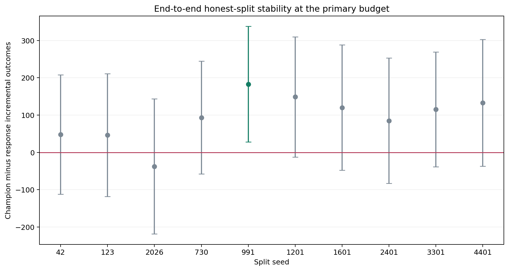

# End-to-End Honest-Split Stability: Criteo visit

## Protocol

- Data: `data/processed/criteo_sample_500k.parquet` (500,000 rows).
- Seeds: `42,123,2026,730,991,1201,1601,2401,3301,4401`.
- Primary budget: `5.00%`.
- Candidate set is deliberately limited to the already locked S-learner and
  response baseline. This is training/split sensitivity, not new model search.
- Every run repeats training, out-of-sample model selection, development
  refitting, nuisance estimation, and locked-test evaluation.
- Each run uses the same pre-specified candidate set and selection rule.

## Aggregate Stability

| runs | mean_difference | std_difference | min_difference | max_difference | positive_point_rate | positive_ci_rate | negative_ci_rate |
| ---- | --------------- | -------------- | -------------- | -------------- | ------------------- | ---------------- | ---------------- |
| 10   | 93.552529       | 62.715458      | -37.696178     | 183.102563     | 0.900000            | 0.100000         | 0.000000         |

## Champion Frequency

| champion  | runs | mean_difference | positive_rate |
| --------- | ---- | --------------- | ------------- |
| s_learner | 10   | 93.552529       | 0.900000      |

## Results by Split

| seed | champion  | difference_vs_response | ci_lower    | ci_upper   | champion_incremental_outcome | response_incremental_outcome | champion_auuc | response_auuc | fit_seconds |
| ---- | --------- | ---------------------- | ----------- | ---------- | ---------------------------- | ---------------------------- | ------------- | ------------- | ----------- |
| 42   | s_learner | 47.889591              | -112.321496 | 208.100679 | 415.817386                   | 367.927795                   | 0.008062      | 0.008924      | 72.538127   |
| 123  | s_learner | 46.541663              | -118.327928 | 211.411255 | 438.655804                   | 392.114141                   | 0.008602      | 0.008765      | 69.999058   |
| 2026 | s_learner | -37.696178             | -218.703373 | 143.311016 | 458.855430                   | 496.551609                   | 0.008153      | 0.009141      | 71.880797   |
| 730  | s_learner | 93.348049              | -57.834951  | 244.531049 | 377.594065                   | 284.246016                   | 0.008080      | 0.008879      | 72.913915   |
| 991  | s_learner | 183.102563             | 27.936737   | 338.268389 | 324.767311                   | 141.664748                   | 0.008238      | 0.008443      | 70.709324   |
| 1201 | s_learner | 148.722565             | -12.678367  | 310.123496 | 407.710961                   | 258.988396                   | 0.008890      | 0.008492      | 72.679125   |
| 1601 | s_learner | 120.236674             | -47.828953  | 288.302301 | 438.034372                   | 317.797698                   | 0.008290      | 0.008483      | 70.631889   |
| 2401 | s_learner | 85.056562              | -83.116963  | 253.230086 | 478.965001                   | 393.908439                   | 0.008638      | 0.008528      | 72.109964   |
| 3301 | s_learner | 115.312227             | -38.805762  | 269.430216 | 376.608813                   | 261.296586                   | 0.008681      | 0.008662      | 72.035666   |
| 4401 | s_learner | 133.011576             | -37.047430  | 303.070583 | 517.754566                   | 384.742990                   | 0.008643      | 0.008830      | 65.099003   |

These repeated splits overlap and are therefore correlated robustness checks,
not independent experiments. They measure sensitivity to training and partition
variation; the canonical locked test remains the primary result.

Raw results: `reports/tables/visit_stability.csv`.
